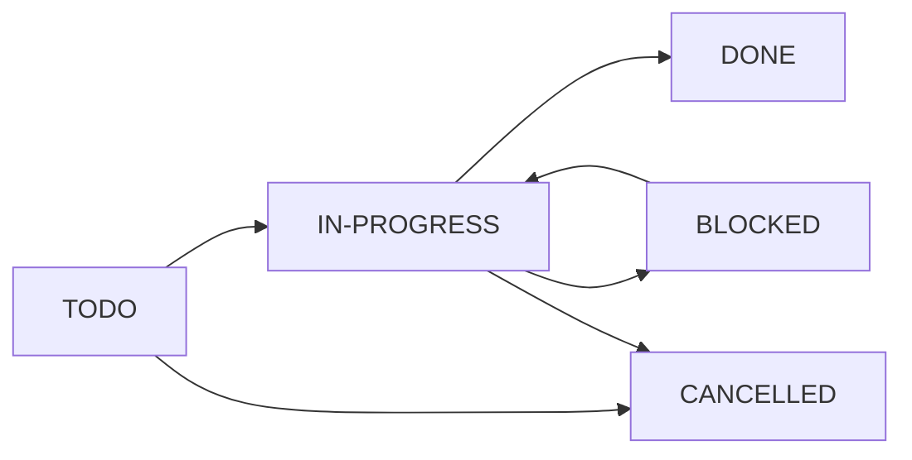

# Task Execution Standards for Torq

## CRITICAL: Status Management Requirements

### 🚨 MANDATORY: Update Status When Starting Work
**EVERY AGENT MUST**:
1. **IMMEDIATELY** update task status to IN-PROGRESS when beginning work
2. **NEVER** work on a task without marking it IN-PROGRESS first
3. **ALWAYS** update to DONE when completing work

```bash
# REQUIRED: First command when starting any task
./org_tasks.sh update TASK-ID IN-PROGRESS

# REQUIRED: When completing task
./org_tasks.sh update TASK-ID DONE
```

### Why This Matters
- Prevents multiple agents working on same task
- Enables accurate progress tracking
- Unblocks dependent tasks when completed
- Maintains system integrity

## Priority Determination Criteria

### Priority A (Critical - Do First)
Assigned when:
- **Blocking other work**: Task blocks 3+ other tasks
- **Production critical**: Affects live system stability
- **Security/Safety**: Addresses vulnerabilities or data integrity
- **Performance regression**: Impacts >1M msg/s target
- **Compliance requirement**: Legal/regulatory mandate

### Priority B (Important - Do Soon)
Assigned when:
- **Feature development**: Core functionality improvements
- **Optimization**: Performance enhancements (non-critical)
- **Technical debt**: Refactoring for maintainability
- **Testing improvements**: Expanding test coverage

### Priority C (Nice to Have - Do Eventually)
Assigned when:
- **Documentation**: Non-critical documentation updates
- **Tooling**: Developer experience improvements
- **Cleanup**: Code organization, formatting
- **Future-proofing**: Preparing for potential features

## Task Lifecycle States



### State Definitions
- **TODO**: Ready to start (dependencies met)
- **NEXT**: Prioritized for immediate work
- **IN-PROGRESS**: Currently being worked on
- **BLOCKED**: Cannot proceed due to external dependency
- **DONE**: Completed successfully
- **CANCELLED**: No longer needed

## TDD Workflow Requirements

### Every Feature = Test First
1. **Test Design Task**: Define comprehensive tests
2. **Implementation Task**: Make tests pass
3. **Refactor Task** (optional): Improve code quality

### Test Design Acceptance Criteria
```org
*** Acceptance Criteria (TDD Red Phase)
- [ ] Successfully builds: `cargo build --test`
- [ ] All tests defined and fail appropriately
- [ ] Passes code review
- [ ] Unit test cases cover all paths
- [ ] Integration test cases defined
- [ ] Edge cases identified and tested
- [ ] Performance tests defined (if applicable)
```

### Implementation Acceptance Criteria
```org
*** Acceptance Criteria (TDD Green Phase)
- [ ] Successfully builds: `cargo build --release`
- [ ] All tests pass: `cargo test --package <name>`
- [ ] Passes code review
- [ ] No performance regression
- [ ] Documentation updated
- [ ] No new warnings introduced
```

## Dependency Management

### Checking Dependencies
```bash
# Before starting work, check if dependencies are met
./org_tasks.sh parse | jq '.tasks[] | select(.id == "TASK-ID") | .depends'

# See what tasks you unblock by completing current work
./org_tasks.sh parse | jq '.tasks[] | select(.depends | contains("TASK-ID"))'
```

### Parallel Work Identification
```bash
# Find tasks that can be done in parallel
./org_tasks.sh ready | jq '.ready_tasks | length'

# Get Priority A work that's ready
python3 agent_task_commands.py priority A
```

## Communication Standards

### When Starting a Task
```markdown
Starting work on TASK-001: Database Schema Design
- Branch: feat/auth-database-schema
- Status updated to IN-PROGRESS
- Estimated completion: 6 hours
- Dependencies: None
```

### When Blocked
```markdown
BLOCKED on TASK-002: API Implementation
- Blocker: Waiting for security review approval
- Status updated to BLOCKED
- Will resume when: Security team completes review
- Alternative work: Moving to TASK-003
```

### When Completing
```markdown
COMPLETED TASK-001: Database Schema Design
- Status updated to DONE
- All tests passing
- Performance benchmarks met
- Unblocked tasks: TASK-002, TASK-003
- PR ready for review: #123
```

## Quality Gates (All Tasks)

### Minimum Requirements
1. ✅ Successfully builds
2. ✅ All tests pass
3. ✅ Passes code review
4. ✅ No regressions
5. ✅ Documentation updated

### Performance Requirements
- No degradation in throughput metrics
- Memory usage within bounds
- Latency targets maintained

## Agent Instructions Template

When handing off tasks to agents, include:

```markdown
## Task Assignment: [TASK-ID]

**CRITICAL**: Read @.claude/docs/TASK_EXECUTION_STANDARDS.md first

### Immediate Actions Required
1. Mark task IN-PROGRESS: `./org_tasks.sh update [TASK-ID] IN-PROGRESS`
2. Create branch: `git checkout -b [branch-name]`
3. Read task details in active.org

### Task Details
- Priority: [A/B/C]
- Effort: [X hours]
- Dependencies: [List or None]
- Branch: [branch-name]

### Acceptance Criteria
[Copy from org file]

### On Completion
1. Run all tests
2. Update status: `./org_tasks.sh update [TASK-ID] DONE`
3. Create PR
4. Report unblocked tasks
```

## Common Pitfalls to Avoid

### ❌ DON'T
- Start work without updating status
- Work on BLOCKED tasks
- Skip test design phase
- Ignore dependencies
- Leave tasks IN-PROGRESS indefinitely

### ✅ DO
- Update status immediately
- Check dependencies first
- Write tests before implementation
- Communicate blockers
- Complete or hand off tasks

## Git Worktree Usage

Tasks marked with `:WORKTREE: yes` should use isolated git worktrees for safety and parallel development.

### When to Use Worktrees
- **Major refactors** (>4h effort, architectural changes)
- **Experimental features** (high risk of breaking changes)  
- **Parallel development** (multiple agents working simultaneously)
- **Complex features** (Mycelium platform, structure linter, etc.)

### Worktree Commands
```bash
# Create task worktree
git worktree add ../task-MVP-001 -b feat/shared-types-foundation

# Work in isolation
cd ../task-MVP-001
# ... do development work ...

# Merge back to main
cd /original/repo
git checkout main
git merge feat/shared-types-foundation

# Cleanup
git worktree remove ../task-MVP-001
git branch -d feat/shared-types-foundation
```

### Benefits
- **Parallel work**: Multiple tasks can progress simultaneously
- **Clean context**: No mixed changes or context switching
- **Safe experimentation**: Failed approaches don't contaminate main workspace
- **Better testing**: Can test one task while developing another

---

*This document is the source of truth for task execution standards. All agents must follow these guidelines.*