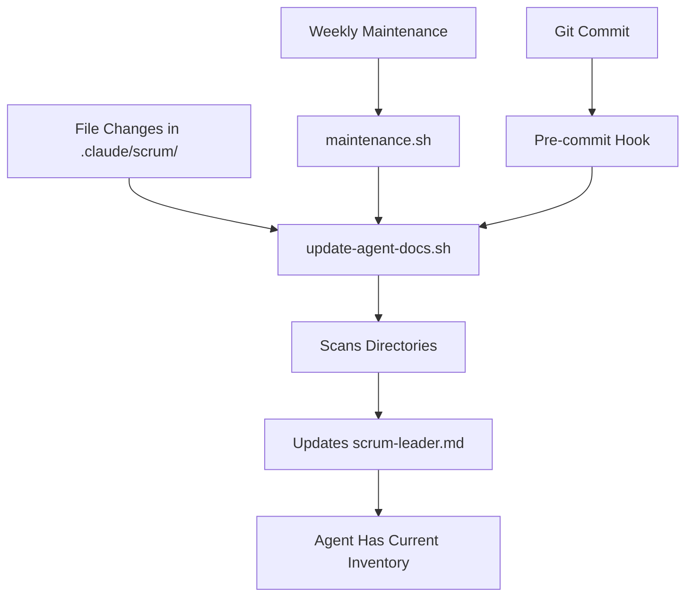

# Self-Documenting Sprint System

## 🎯 Core Principle
**The system must document itself automatically to prevent drift and decay.**

## 🔄 Auto-Documentation Flow



## 📋 What Gets Auto-Documented

### 1. Scripts (.claude/scrum/*.sh)
- task-manager.sh
- create-sprint.sh  
- maintenance.sh
- update-agent-docs.sh
- All other shell scripts

### 2. Templates (.claude/scrum/templates/)
- SPRINT_PLAN.md
- TASK_TEMPLATE.md
- TEST_RESULTS.md

### 3. Documentation (.claude/scrum/*.md)
- STANDARDIZATION.md
- TEMPLATES.md
- ARCHIVING.md
- SUSTAINABILITY.md
- All other markdown docs

### 4. Active Sprints (.claude/tasks/sprint-*)
- Lists all non-archived sprints
- Updates count automatically

### 5. Archived Sprints (.claude/tasks/archive/)
- Tracks total archived count
- Updates after auto-archive

## 🤖 How It Works

### The Updater Script
`update-agent-docs.sh` does:
1. Preserves manual content in scrum-leader.md
2. Regenerates file inventory section
3. Scans all relevant directories
4. Updates with current timestamp
5. Maintains command reference

### Integration Points

#### Weekly Maintenance
```bash
# maintenance.sh now includes:
./.claude/scrum/update-agent-docs.sh
```

#### Git Hooks (Optional)
```bash
# .git/hooks/pre-commit can include:
if git diff --cached --name-only | grep -q "^.claude/scrum/"; then
    ./.claude/scrum/update-agent-docs.sh
    git add .claude/agents/scrum-leader.md
fi
```

#### Manual Updates
```bash
# Run anytime after file changes
./.claude/scrum/update-agent-docs.sh
```

## 🛡️ Preventing Documentation Drift

### Problem: Manual Documentation
**Without automation**, documentation always drifts:
- Scripts get added but not documented
- Deleted files still referenced
- Templates forgotten
- Commands outdated

### Solution: Auto-Generation
**With automation**:
- File inventory always current
- Commands verified to exist
- Templates actually present
- No manual updates needed

## 📊 Verification

### Check Documentation Currency
```bash
# Look for timestamp in scrum-leader.md
grep "Last updated:" .claude/agents/scrum-leader.md

# Should show recent date if maintenance ran
```

### Verify File Existence
```bash
# The agent file includes this check:
for script in task-manager.sh create-sprint.sh maintenance.sh; do
    if [[ -f ".claude/scrum/$script" ]]; then
        echo "✅ $script exists"
    else
        echo "❌ $script MISSING!"
    fi
done
```

## 🚨 When Documentation Fails

### Red Flags
- scrum-leader.md references non-existent scripts
- Commands in documentation don't work
- File inventory shows wrong counts
- Last updated > 1 week old

### Recovery
```bash
# Force regeneration
./.claude/scrum/update-agent-docs.sh

# Verify integrity
./.claude/scrum/maintenance.sh

# Check all scripts exist
ls -la .claude/scrum/*.sh
```

## 💡 Best Practices

### DO ✅
1. Run updater after adding scripts
2. Include in weekly maintenance
3. Check timestamp regularly
4. Keep auto-generated sections intact
5. Test commands from documentation

### DON'T ❌
1. Manually edit auto-generated sections
2. Skip update after file changes
3. Delete update-agent-docs.sh
4. Ignore documentation drift warnings
5. Reference files without checking existence

## 🎓 For New Developers

### Understanding the System
1. Read scrum-leader.md file inventory
2. Check which scripts are available
3. Verify templates exist
4. Run maintenance to see health

### Adding New Tools
```bash
# 1. Create your script
vim .claude/scrum/new-tool.sh
chmod +x .claude/scrum/new-tool.sh

# 2. Update documentation
./.claude/scrum/update-agent-docs.sh

# 3. Verify it appears
grep "new-tool.sh" .claude/agents/scrum-leader.md
```

## 🔮 Future Enhancements

### Potential Improvements
1. **Auto-generate command help**: Extract usage from scripts
2. **Validate all paths**: Check every referenced file exists
3. **Generate dependency graph**: Show which scripts call others
4. **Track script versions**: Include modification dates
5. **Auto-update README**: Keep main README synchronized

### Maintain Simplicity
Whatever enhancements:
- Keep it fast (<1 second)
- Single responsibility (inventory only)
- No external dependencies
- Preserve manual content
- Stay readable

## 📚 Related Documentation
- `scrum-leader.md` - The self-documenting agent file
- `update-agent-docs.sh` - The updater script
- `maintenance.sh` - Includes auto-update
- `SUSTAINABILITY.md` - Long-term health strategies

## Final Word

**A self-documenting system is a sustainable system.** By automatically maintaining its own inventory, the system prevents the #1 cause of decay: documentation drift. Every script knows what exists, every command is verified, and future instances can trust the inventory.

The overhead is minimal (one script run), but the benefit is massive: a system that gets more reliable with age instead of more fragile.