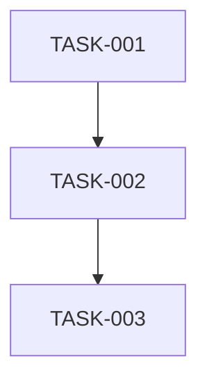

# Standardized Sprint & Task Templates

## Overview
These templates ensure consistency across all sprints and tasks, enabling automated parsing and management. Every sprint and task MUST follow these formats exactly.

---

## 📋 SPRINT TEMPLATE

Create this as `SPRINT_PLAN.md` in each sprint directory:

```markdown
# Sprint XXX: [Sprint Name]

**Duration**: 5 days
**Start Date**: YYYY-MM-DD
**End Date**: YYYY-MM-DD
**Status**: NOT_STARTED | IN_PROGRESS | COMPLETE | ARCHIVED

## Sprint Goals
1. [Primary objective - what will be achieved]
2. [Secondary objectives if any]
3. [Success metrics]

## Task Summary
| Task ID | Description | Status | Priority | Hours |
|---------|-------------|--------|----------|-------|
| TASK-001 | [Description] | TODO | CRITICAL | 3 |
| TASK-002 | [Description] | TODO | HIGH | 2 |
| TASK-003 | [Description] | TODO | MEDIUM | 4 |

## Dependencies


## Definition of Done
- [ ] All tasks marked COMPLETE
- [ ] Tests passing (documented in TEST_RESULTS.md)
- [ ] PR merged to main
- [ ] No performance regressions
- [ ] Documentation updated

## Risk Mitigation
- **Risk 1**: [Description] → Mitigation: [Strategy]
- **Risk 2**: [Description] → Mitigation: [Strategy]
```

---

## 📝 TASK TEMPLATE

Create individual task files as `TASK-XXX_description.md`:

```markdown
---
task_id: TASK-XXX
status: TODO
priority: CRITICAL
estimated_hours: 3
assigned_branch: fix/specific-issue-name
assignee: TBD
created: YYYY-MM-DD
completed: null
---

# TASK-XXX: [Clear Task Description]

## 🔴 CRITICAL INSTRUCTIONS
```bash
# BEFORE STARTING - VERIFY YOU'RE NOT ON MAIN:
git branch --show-current

# If you see "main", IMMEDIATELY run:
git checkout -b fix/specific-issue-name

# NEVER commit directly to main!
```

## Status
**Status**: TODO
**Priority**: CRITICAL | HIGH | MEDIUM | LOW
**Branch**: `fix/specific-issue-name`
**Estimated**: 3 hours

## Problem Statement
[Clear description of what problem this solves or what feature this adds]

## Acceptance Criteria
- [ ] [Specific measurable outcome]
- [ ] [Another specific outcome]
- [ ] Tests written and passing
- [ ] No performance regression
- [ ] Documentation updated if needed

## Technical Approach
### Files to Modify
- `path/to/file1.rs` - [What changes]
- `path/to/file2.rs` - [What changes]

### Implementation Steps
1. [First step with specific details]
2. [Second step with specific details]
3. [Third step with specific details]

## Testing Instructions
```bash
# Run these tests to verify your changes:
cargo test --package package_name --test test_name

# Check for regressions:
cargo test --workspace

# Verify performance:
cargo bench --bench benchmark_name
```

## Git Workflow
```bash
# 1. Start on your branch
git checkout -b fix/specific-issue-name

# 2. Make changes and commit
git add -A
git commit -m "fix: clear description of change"

# 3. Push to your branch
git push origin fix/specific-issue-name

# 4. Create PR
gh pr create --title "Fix: Clear description" --body "Closes TASK-XXX"
```

## Completion Checklist
- [ ] Working on correct branch (not main)
- [ ] All acceptance criteria met
- [ ] Tests written and passing
- [ ] Code reviewed locally
- [ ] PR created
- [ ] Updated task status to COMPLETE
```

---

## 📊 TEST_RESULTS.md TEMPLATE

Create when tests complete:

```markdown
# Test Results - Sprint XXX

**Date**: YYYY-MM-DD
**Status**: PASS | FAIL | PARTIAL

## Test Summary
- Total Tests: XXX
- Passed: XXX
- Failed: XXX
- Skipped: XXX

## Test Output
```
[Paste actual test output here]
```

## Performance Tests
- Baseline: X msg/s
- Current: X msg/s
- Delta: +X%

## Coverage Report
- Line Coverage: XX%
- Branch Coverage: XX%

## Verification
✅ All tests passing
✅ No performance regressions
✅ Coverage maintained

## Sign-off
Tested by: [Name/System]
Date: YYYY-MM-DD
```

---

## 🏁 COMPLETION WORKFLOW

### For Developers
1. **Start Task**:
   ```bash
   # Read task file first
   cat .claude/tasks/sprint-XXX/TASK-001_description.md
   
   # Checkout branch specified in task
   git checkout -b fix/specific-issue-name
   ```

2. **Update Status**:
   ```bash
   # Edit task file, change:
   # Status: TODO → Status: IN_PROGRESS
   ```

3. **Complete Task**:
   ```bash
   # Run tests
   cargo test
   
   # Update task file:
   # Status: IN_PROGRESS → Status: COMPLETE
   # completed: null → completed: YYYY-MM-DD
   ```

4. **Create PR**:
   ```bash
   gh pr create --title "Sprint XXX: Task description"
   ```

### For Task Manager Script
The script looks for these exact patterns:
- `**Status**: TODO|IN_PROGRESS|COMPLETE|BLOCKED`
- `**Priority**: CRITICAL|HIGH|MEDIUM|LOW`
- `status: TODO` (in YAML frontmatter)
- `✅ All tests passing` (in TEST_RESULTS.md)

---

## 🔧 AUTOMATION HOOKS

### Pre-Task Hook
```bash
#!/bin/bash
# Runs before starting any task
CURRENT_BRANCH=$(git branch --show-current)
if [ "$CURRENT_BRANCH" = "main" ]; then
    echo "❌ ERROR: Cannot work on main branch!"
    exit 1
fi
```

### Post-Task Hook
```bash
#!/bin/bash
# Runs after marking task complete
if ! cargo test --quiet; then
    echo "❌ ERROR: Tests must pass before marking complete!"
    exit 1
fi
```

### Sprint Completion Hook
```bash
#!/bin/bash
# Triggered when all tasks complete
if [ -f "TEST_RESULTS.md" ] && grep -q "All tests passing" TEST_RESULTS.md; then
    echo "✅ Sprint ready for archiving"
fi
```

---

## 📐 FORMAT VALIDATION

### Valid Status Values
- `TODO` - Not started
- `IN_PROGRESS` - Currently working
- `COMPLETE` - Finished successfully
- `BLOCKED` - Cannot proceed
- `ARCHIVED` - Sprint archived

### Valid Priority Values
- `CRITICAL` - Must be done immediately
- `HIGH` - Should be done soon
- `MEDIUM` - Normal priority
- `LOW` - Nice to have

### Branch Naming Convention
- `fix/` - Bug fixes
- `feat/` - New features
- `perf/` - Performance improvements
- `test/` - Test additions
- `docs/` - Documentation only

---

## 🚀 QUICK START

```bash
# 1. Create new sprint
mkdir -p .claude/tasks/sprint-007-feature-name
cd .claude/tasks/sprint-007-feature-name

# 2. Copy templates
cp ../../scrum/templates/SPRINT_PLAN.md .
cp ../../scrum/templates/TASK_TEMPLATE.md TASK-001_description.md

# 3. Fill in details
vim SPRINT_PLAN.md
vim TASK-001_description.md

# 4. Verify format
../../scrum/task-manager.sh scan

# 5. Start work
git checkout -b fix/task-001-issue
```

---

## ⚠️ IMPORTANT NOTES

1. **Consistency is Critical**: The automation depends on exact formatting
2. **Never Skip Status Updates**: Keep task files current
3. **Branch Names Matter**: Use the exact branch specified in task
4. **Test Before Complete**: Never mark done without passing tests
5. **Document Everything**: Future you will thank present you

This standardization enables:
- Automated status tracking
- Consistent PR creation
- Reliable archiving
- Clear handoffs between developers
- Historical analysis of velocity