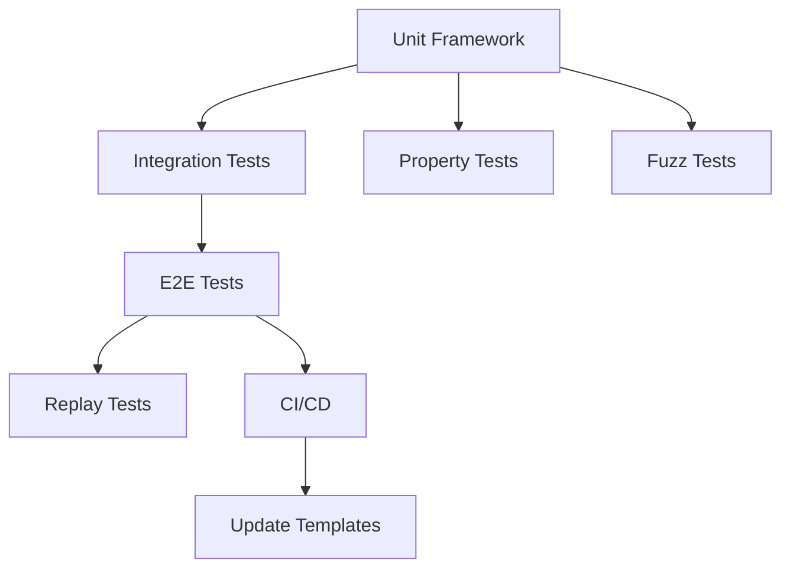

# Sprint 009: Testing Pyramid Implementation

**Duration**: 5 days
**Start Date**: 2025-01-27
**End Date**: 2025-01-31
**Status**: NOT_STARTED

## Sprint Goals
1. Implement comprehensive testing pyramid (unit → integration → E2E)
2. Add specialized financial testing (property-based, fuzz, replay)
3. Achieve >80% coverage on critical paths (protocol, calculations, state)
4. Update templates to enforce testing standards
5. Create automated test infrastructure

## Task Summary
| Task ID | Description | Status | Priority | Hours |
|---------|-------------|--------|----------|-------|
| TEST-001 | Unit test framework for protocol_v2 | TODO | CRITICAL | 4 |
| TEST-002 | Integration tests for relay communication | TODO | CRITICAL | 4 |
| TEST-003 | E2E golden path test (full pipeline) | TODO | CRITICAL | 4 |
| TEST-004 | Property-based tests for arbitrage calculations | TODO | HIGH | 3 |
| TEST-005 | Fuzz testing for TLV parser | TODO | HIGH | 3 |
| TEST-006 | Live market replay infrastructure | TODO | MEDIUM | 4 |
| TEST-007 | Update task templates with testing requirements | TODO | HIGH | 2 |
| TEST-008 | CI/CD integration for test suite | TODO | HIGH | 3 |

## Testing Pyramid Architecture

```
         /\
        /E2E\       Layer 3: End-to-End Tests (1-5 tests)
       /______\      - Full pipeline validation
      /        \     - Real market scenarios
     /Integration\   Layer 2: Integration Tests (20-50 tests)
    /______________\  - Component collaboration
   /                \ - Public API validation
  /    Unit Tests    \ Layer 1: Unit Tests (200+ tests)
 /____________________\ - Function-level validation
                        - Fast, isolated, precise
```

## Dependencies


## Definition of Done
- [ ] All test categories implemented (unit, integration, E2E, specialized)
- [ ] Critical path coverage >80%
- [ ] Tests run in <5 minutes (excluding E2E)
- [ ] CI/CD pipeline includes all test levels
- [ ] Templates updated with testing requirements
- [ ] No hardcoded data possible in tested paths
- [ ] Documentation includes testing guide

## Risk Mitigation
- **Risk**: Test suite too slow → **Mitigation**: Parallelize tests, separate fast/slow suites
- **Risk**: Flaky E2E tests → **Mitigation**: Use deterministic test data, control timing
- **Risk**: Low adoption → **Mitigation**: Integrate into templates, enforce in CI

## Success Metrics
- Unit test count: >200
- Integration test count: >50
- E2E test count: 5-10
- Test execution time: <5 min for unit+integration
- Coverage: >80% on critical paths
- Bug detection rate: Catch issues before production

## Testing Standards (To Be Enforced)

### Layer 1: Unit Tests
```rust
#[cfg(test)]
mod tests {
    use super::*;
    
    #[test]
    fn test_specific_behavior() {
        // Given: Setup
        let input = create_test_input();
        
        // When: Action
        let result = function_under_test(input);
        
        // Then: Assert
        assert_eq!(result, expected_value);
    }
}
```

### Layer 2: Integration Tests
```rust
// In tests/integration_test.rs
#[test]
fn test_component_interaction() {
    // Start components
    let relay = start_test_relay();
    let consumer = connect_consumer();
    
    // Send message
    relay.send(test_message);
    
    // Verify receipt
    assert_eq!(consumer.receive(), expected_message);
}
```

### Layer 3: E2E Tests
```rust
// In tests/e2e/golden_path.rs
#[test]
fn test_full_pipeline() {
    // Start entire system
    let system = start_test_system();
    
    // Inject known market data
    system.inject_market_data(known_data);
    
    // Verify output
    let signal = system.await_signal();
    assert_eq!(signal.profit, calculated_profit);
    assert!(signal.profit > 0); // Would catch hardcoded $150!
}
```

## Daily Progress
### Day 1 - Unit Test Foundation
- [ ] TEST-001 started (protocol_v2 unit tests)
- [ ] Branch created: test/unit-test-framework
- Notes: Focus on TLV serialization/deserialization

### Day 2 - Integration Layer
- [ ] TEST-002 started (relay integration tests)
- [ ] Branch created: test/integration-tests
- Notes: Test component communication

### Day 3 - E2E Golden Path
- [ ] TEST-003 started (full pipeline test)
- [ ] Branch created: test/e2e-golden-path
- Notes: Would catch hardcoded data issues

### Day 4 - Specialized Testing
- [ ] TEST-004 & TEST-005 (property & fuzz tests)
- [ ] Branch created: test/specialized-tests
- Notes: Financial edge cases and security

### Day 5 - Infrastructure & Templates
- [ ] TEST-006, TEST-007, TEST-008
- [ ] PR review and merge
- Notes: Automation and enforcement