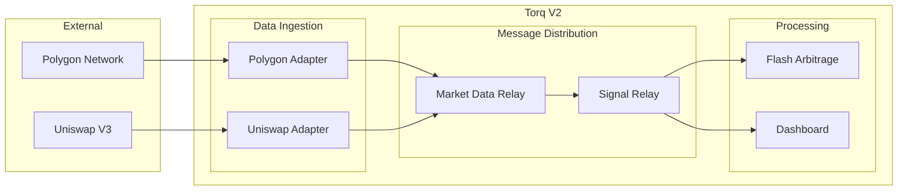

# ARCH-001: Target Architecture README - The North Star Document

## 🔴 CRITICAL INSTRUCTIONS

### 0. 📋 MARK AS IN-PROGRESS IMMEDIATELY
**⚠️ FIRST ACTION: Change status when you start work!**
```yaml
# Edit the YAML frontmatter above:
status: TODO → status: IN_PROGRESS

# This makes the kanban board show you're working on it!
```

### 1. Git Branch Safety
```bash
# BEFORE STARTING - VERIFY YOU'RE NOT ON MAIN:
git branch --show-current

# If you see "main", IMMEDIATELY run:
git worktree add -b feat/architecture-synthesis-readme

# NEVER commit directly to main!
```

### 2. 🧪 DOCUMENTATION-DRIVEN DEVELOPMENT MANDATORY
**⚠️ This is a documentation sprint - write docs FIRST, validate with team!**
```bash
# WORKFLOW: DRAFT → REVIEW → REFINE → VALIDATE
# 1. Write draft documentation
# 2. Review with team/stakeholders  
# 3. Refine based on feedback
# 4. Validate against actual codebase
```

## Status
**Status**: TODO (⚠️ CHANGE TO IN_PROGRESS WHEN YOU START!)
**Priority**: CRITICAL  
**Branch**: `feat/architecture-synthesis-readme`
**Estimated**: 4 hours

## Problem Statement
Torq currently lacks a coherent, single-source-of-truth architectural overview. Developers (both existing and new) struggle to understand how the various sprint outcomes fit together into a unified system design. There's no "north star" document explaining the three-layer architecture philosophy or how components interact.

## Acceptance Criteria
- [ ] Root README.md serves as definitive architectural overview
- [ ] Three-layer philosophy (Data/Rules/Behavior) clearly explained with examples
- [ ] Component breakdown shows clear responsibilities for libs/, network/, services_v2/, relays/
- [ ] Quick start section using manage.sh for immediate developer productivity
- [ ] Architecture diagrams (mermaid) show system structure and data flow
- [ ] Design principles and constraints documented
- [ ] Links to detailed documentation for deeper dives
- [ ] New developer can understand system in <30 minutes
- [ ] All architectural vocabulary used consistently

## Technical Approach
### Files to Create/Modify
- `README.md` (root) - Main architectural overview document
- `docs/ARCHITECTURE.md` - Detailed architecture guide
- `docs/diagrams/` - Directory for mermaid diagrams
- Update existing documentation links to point to new structure

### Implementation Steps - Documentation-First Approach

1. **DRAFT**: Create comprehensive README.md structure
   ```bash
   # Start with the key sections
   cat > README.md << 'EOF'
   # Torq V2: System Architecture
   
   ## Core Philosophy
   [Three-layer explanation]
   
   ## Quick Start  
   [Using manage.sh commands]
   
   ## Component Overview
   [Directory structure + responsibilities]
   
   ## Architecture
   [Visual diagrams and flow]
   
   ## Development
   [Common workflows]
   EOF
   ```

2. **REVIEW**: Validate against actual codebase structure
   ```bash
   # Ensure documentation matches reality
   find . -type d -name "libs" -o -name "services_v2" -o -name "relays" | head -10
   ls -la scripts/manage.sh  # Verify control script exists
   ```

3. **REFINE**: Add mermaid diagrams for visual clarity
   ```mermaid
   graph TD
       subgraph "Data Layer"
           Types[libs/types<br/>TradeTLV, PoolInfo]
           Codec[libs/codec<br/>Protocol Rules]
       end
       
       subgraph "Behavior Layer"  
           Adapters[services_v2/adapters]
           Relays[relays/]
       end
       
       Adapters --> Types
       Relays --> Codec
   ```

4. **VALIDATE**: Test with new developer perspective

## Architecture Content Structure

### Root README.md Template
```markdown
# Torq V2: High-Performance Trading System

> Built on clean three-layer architecture for scalability and maintainability

## 🏗️ Core Philosophy

The system separates concerns across three distinct layers:

1. **The Data (`libs/types`)**: Pure data structures that represent system concepts
   - `TradeTLV`, `ArbitrageOpportunity`, `PoolInfo` 
   - System's "vocabulary" - what we talk about

2. **The Rules (`libs/codec`)**: Protocol logic that defines communication
   - Parsing, validation, construction of messages
   - System's "grammar" - how we communicate

3. **The Behavior**: Active components that perform work using Data + Rules
   - Services, Relays, Network transport
   - System's "actions" - what we do

## 🚀 Quick Start

```bash
# Start entire Torq system
./scripts/manage.sh up

# Check what's running
./scripts/manage.sh status  

# Stream all service logs
./scripts/manage.sh logs

# Stop everything cleanly
./scripts/manage.sh down
```

## 📁 Component Overview

```
torq_backend_v2/
├── libs/                 # 🏗️ Shared foundation
│   ├── types/            #    Pure data structures  
│   ├── codec/ #    Protocol rules
│   ├── health_check/     #    Health utilities
│   └── config/           #    Configuration macros
├── network/              # 🌐 Mycelium transport (bytes only)
├── services_v2/          # 🧠 Business logic
│   ├── adapters/         #    External data connections
│   ├── strategies/       #    Trading algorithms  
│   └── dashboard/        #    UI backend
├── relays/               # 🔄 Message-passing hubs
│   ├── src/common/       #    Generic relay engine
│   └── src/              #    Domain-specific logic
└── scripts/              # ⚙️ System management
    ├── manage.sh         #    Unified control interface
    └── lib/              #    Internal management scripts
```

### Component Responsibilities

| Component | Purpose | Dependencies | Examples |
|-----------|---------|--------------|----------|
| **libs/types** | Define system vocabulary | None (pure data) | `TradeTLV`, `PoolInfo`, `ArbitrageSignal` |
| **libs/codec** | Protocol rules & validation | libs/types | TLV parsing, message building |
| **network/** | Byte transport (Mycelium) | None | Unix sockets, message passing |
| **services_v2/adapters** | External data ingestion | types + codec | Polygon collector, Uniswap adapter |
| **services_v2/strategies** | Trading logic | types + codec | Flash arbitrage, signal processing |
| **relays/** | Message distribution hubs | types + codec + network | Market data relay, signal relay |
| **scripts/** | System lifecycle | All components | Startup, shutdown, monitoring |

## 📊 Architecture Flow



## 🛠️ Development Workflow

### Adding New Features
1. **Define data structures** in `libs/types/`
2. **Add protocol rules** in `libs/codec/` if needed
3. **Implement behavior** in appropriate service/relay
4. **Test end-to-end** using unified test framework

### Common Tasks
- **Adding new exchange**: Create adapter in `services_v2/adapters/`
- **New trading strategy**: Implement in `services_v2/strategies/`
- **Protocol changes**: Update `libs/codec/`
- **System monitoring**: Extend `scripts/lib/status.sh`

## 📖 Documentation

- [Detailed Architecture Guide](docs/ARCHITECTURE.md)
- [Developer Onboarding](docs/DEVELOPER_ONBOARDING.md)  
- [Sprint Synthesis](docs/SPRINT_SYNTHESIS.md)
- [Migration Roadmap](docs/MIGRATION_ROADMAP.md)
- [Architecture Decisions](docs/adr/)

## 🎯 Design Principles

1. **Separation of Concerns**: Data, Rules, and Behavior are clearly separated
2. **Dependency Direction**: Behavior depends on Rules, Rules depend on Data
3. **Single Responsibility**: Each component has one clear purpose
4. **Testability**: Clean architecture enables comprehensive testing
5. **Maintainability**: Clear boundaries make changes predictable
6. **Performance**: Zero-copy operations where possible, <35μs hot paths

## 📈 Performance Targets

- **Message Processing**: >1M msg/s construction, >1.6M msg/s parsing
- **Latency**: <35μs for hot path operations
- **Startup Time**: <30 seconds for full system via `manage.sh up`
- **Memory Usage**: <50MB per service
- **Precision**: Zero loss (native token decimals preserved)

---

*Torq V2 is designed for institutional-grade cryptocurrency trading with microsecond precision and institutional reliability.*
```

## Validation Requirements
- Documentation matches actual codebase structure
- All referenced files/directories exist
- Quick start commands actually work
- Architecture diagrams accurately reflect system flow
- New developer can follow documentation and understand system
- All sprint outcomes clearly map to documented architecture

## Testing Requirements

### Documentation Testing
```bash
#!/bin/bash
# tests/test_architecture_docs.sh

test_readme_structure() {
    # Verify README has all required sections
    sections=("Core Philosophy" "Quick Start" "Component Overview" "Architecture Flow")
    for section in "${sections[@]}"; do
        if ! grep -q "$section" README.md; then
            echo "❌ Missing section: $section"
            return 1
        fi
    done
    echo "✅ README structure complete"
}

test_referenced_files_exist() {
    # Verify all referenced files/directories actually exist
    dirs=("libs/types" "libs/codec" "services_v2/adapters" "relays/src/common")
    for dir in "${dirs[@]}"; do
        if [[ ! -d "$dir" ]]; then
            echo "❌ Referenced directory missing: $dir"
            return 1
        fi
    done
    echo "✅ All referenced directories exist"
}

test_manage_script_commands() {
    # Verify manage.sh commands mentioned in docs actually work
    if [[ ! -x "scripts/manage.sh" ]]; then
        echo "❌ manage.sh script not found or not executable"
        return 1
    fi
    
    # Test help output
    if ! ./scripts/manage.sh 2>&1 | grep -q "Usage:"; then
        echo "❌ manage.sh doesn't show proper usage"
        return 1
    fi
    
    echo "✅ manage.sh commands work as documented"
}

# Run all tests
test_readme_structure
test_referenced_files_exist
test_manage_script_commands
echo "All documentation tests passed!"
```

### Visual Validation
```bash
# Generate architecture diagrams for review
mermaid-cli -i docs/architecture.mmd -o docs/architecture.svg
# Review generated diagrams match described architecture
```

## Git Workflow
```bash
# 1. Start on your branch
git worktree add -b feat/architecture-synthesis-readme

# 2. Create comprehensive README
# Follow the template structure above

# 3. Validate against codebase
./tests/test_architecture_docs.sh

# 4. Get team review
# Share draft for feedback before committing

# 5. Commit when validated
git add README.md docs/ARCHITECTURE.md
git commit -m "feat: create definitive architecture documentation

- Add comprehensive README.md with three-layer philosophy
- Include component overview with clear responsibilities  
- Add architecture flow diagrams with mermaid
- Document quick start using manage.sh commands
- Establish north star for all future development
- Map all sprint outcomes to architectural vision

Addresses ARCH-001: Target Architecture README"

# 6. Create PR
git push origin feat/architecture-synthesis-readme
gh pr create --title "feat: Architecture North Star Documentation" --body "Creates definitive architectural overview (ARCH-001)"
```

## Completion Checklist
- [ ] **🚨 STEP 0: Changed status to IN_PROGRESS when starting** ← AGENTS MUST DO THIS!
- [ ] Working on correct branch (not main)
- [ ] **🚨 DOCUMENTATION-FIRST: Draft created and reviewed**
- [ ] Root README.md created with comprehensive architecture overview
- [ ] Three-layer philosophy clearly explained with examples
- [ ] Component responsibilities documented with examples  
- [ ] Architecture flow diagrams created (mermaid)
- [ ] Quick start section using manage.sh commands
- [ ] All referenced files/directories verified to exist
- [ ] Documentation tests pass
- [ ] Team review completed
- [ ] PR created
- [ ] **🚨 STEP FINAL: Updated task status to COMPLETE** ← AGENTS MUST DO THIS!

## ⚠️ IMPORTANT: Status Updates Required
**When you START this task, you MUST:**
1. **IMMEDIATELY** change `status: TODO` to `status: IN_PROGRESS` in the YAML frontmatter above
2. This makes the kanban board show you're working on it

**When you FINISH this task, you MUST:**
1. Change `status: IN_PROGRESS` to `status: COMPLETE` in the YAML frontmatter above  
2. This is NOT optional - the task-manager.sh depends on accurate status
3. Update immediately after PR is merged, not before

**Status Flow: TODO → IN_PROGRESS → COMPLETE**

## Notes
This README.md will serve as the definitive "north star" for the entire project. It should be comprehensive enough for new developers to understand the system in 30 minutes, yet concise enough to serve as a quick reference. Focus on clarity and visual diagrams to make the architecture immediately understandable.