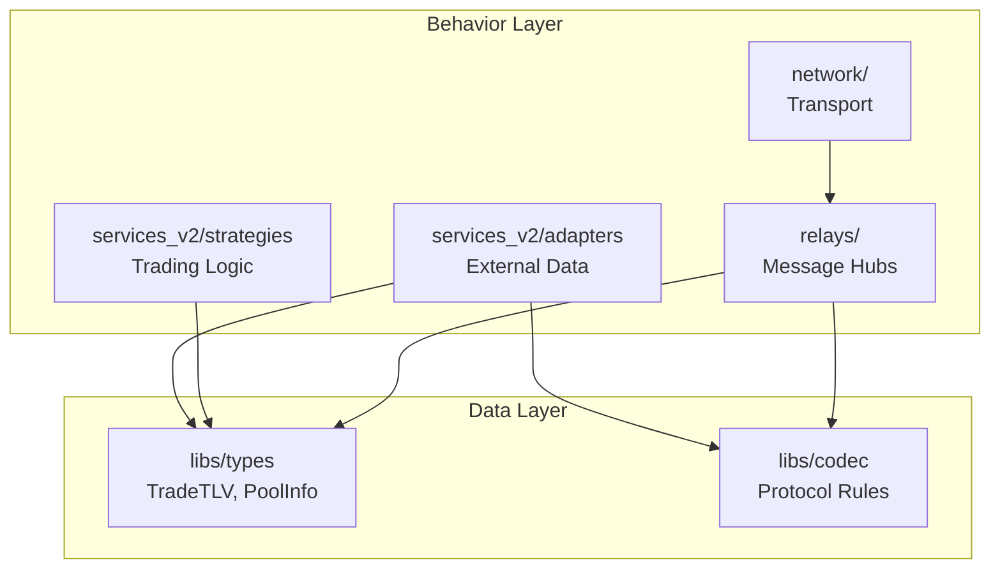

# Sprint 012: Architecture Synthesis & North Star Documentation
*Sprint Duration: 3-4 days*
*Objective: Create coherent target architecture documentation that synthesizes all sprint outcomes into a clear "north star"*

## Mission Statement
Synthesize the outcomes of all major refactoring sprints (protocol-to-codec migration, generic relay refactor, adapter cleanup, control script) into a single, coherent target architecture. Create comprehensive documentation that serves as the definitive "north star" for project structure, making the system's design philosophy crystal clear for all developers.

## Core Problems Being Solved
1. **Architecture Fragmentation**: Individual sprints have improved components but overall system design is unclear
2. **Missing Big Picture**: No single document explains how all pieces fit together  
3. **Developer Onboarding**: New contributors lack a clear mental model of the system
4. **Design Drift**: Without clear target architecture, future changes may deviate from intended design
5. **Sprint Alignment**: Ongoing sprints need unified direction toward common architectural vision
6. **Legacy Confusion**: Mixed old/new patterns create cognitive overhead

## Target Architecture Vision

### Three-Layer Philosophy
1. **The Data (`libs/types`)**: Pure data structures - the system's "vocabulary"
2. **The Rules (`libs/codec`)**: Protocol logic - the system's "grammar"  
3. **The Behavior (Services/Relays/Network)**: Active components that use types+codec

### Directory Structure (Target State)
```
torq_backend_v2/
├── libs/                 # Core shared libraries - the "foundation"
│   ├── types/            # Pure data structs/enums (TradeTLV, PoolInfo)
│   ├── codec/ # Protocol logic (parsing, building, validation)
│   ├── health_check/     # Shared health check utilities
│   └── config/           # Configuration loading and macros
├── network/              # Mycelium transport - handles bytes only
├── relays/               # Message-passing hubs on generic engine
│   ├── src/bin/          # Entry points (market_data_relay, etc.)
│   ├── src/common/       # Generic relay engine and logic trait
│   └── src/              # Domain-specific logic (market_data.rs, etc.)
├── services_v2/          # Business logic and external connections
│   ├── adapters/         # Plugin-style external data source adapters
│   ├── strategies/       # Trading algorithms
│   └── dashboard/        # UI backend
├── scripts/              # Unified system management
│   ├── manage.sh         # Single entry point: up/down/status/logs
│   └── lib/              # Internal management scripts
└── tests/                # End-to-end integration tests
```

## Task Breakdown

### 🔴 Core Documentation

#### ARCH-001: Target Architecture README
**Priority**: CRITICAL
**Estimate**: 4 hours
**Status**: TODO
**Files**: `README.md` (root), `docs/ARCHITECTURE.md`

Create the definitive architectural overview document:
- Three-layer philosophy explanation with concrete examples
- Component breakdown with clear responsibilities
- Data flow diagrams showing how pieces interact
- Design principles and constraints
- Local development quick start

**Key Sections**:
- [ ] Core Philosophy (Data/Rules/Behavior layers)
- [ ] Component Breakdown (libs, network, services_v2, relays)
- [ ] Data Flow Architecture (with mermaid diagrams)
- [ ] Development Workflow (using manage.sh)
- [ ] Design Principles and Constraints

#### ARCH-002: Sprint Synthesis Document
**Priority**: HIGH
**Estimate**: 3 hours
**Status**: TODO
**Files**: `docs/SPRINT_SYNTHESIS.md`

Document how all completed sprints contribute to target architecture:
- Map each sprint's outcomes to architectural components
- Show progression from current state to target state
- Identify remaining gaps and future sprint priorities
- Create migration roadmap for achieving target structure

**Sprint Mapping**:
- [ ] Sprint 002 (Cleanup) → Foundation for clean architecture
- [ ] Sprint 006 (Protocol Optimization) → libs/types and macros
- [ ] Sprint 007 (Generic Relay) → relays/common engine
- [ ] Sprint 009 (Testing Pyramid) → tests/ strategy
- [ ] Sprint 010 (Codec Separation) → libs/codec
- [ ] Sprint 011 (Control Script) → scripts/manage.sh

### 🟡 Visual Architecture

#### ARCH-003: System Architecture Diagrams
**Priority**: HIGH
**Estimate**: 3 hours
**Status**: TODO
**Files**: `docs/diagrams/` directory

Create comprehensive visual documentation:
- System overview diagram showing all major components
- Data flow diagrams for key scenarios (trade processing, arbitrage)
- Component interaction diagrams
- Deployment architecture diagram

**Diagrams to Create**:
- [ ] System Overview (libs → network → services → relays)
- [ ] Data Flow: Market Data Ingestion
- [ ] Data Flow: Signal Processing & Execution
- [ ] Component Dependencies (what depends on what)
- [ ] Deployment Architecture (process boundaries)

#### ARCH-004: Developer Onboarding Guide
**Priority**: MEDIUM
**Estimate**: 2 hours
**Status**: TODO
**Files**: `docs/DEVELOPER_ONBOARDING.md`

Create comprehensive guide for new contributors:
- Mental model of the system architecture
- Common development workflows
- Where to find things (file organization)
- How to add new features (following architectural patterns)
- Testing strategy aligned with architecture

**Guide Sections**:
- [ ] "15-minute Architecture Overview" 
- [ ] "Where to Find Things" (navigation guide)
- [ ] "Adding New Features" (pattern guidance)
- [ ] "Common Development Tasks"
- [ ] "Architecture Decision Records (ADRs)"

### 🟢 Migration & Alignment

#### ARCH-005: Gap Analysis & Migration Plan
**Priority**: MEDIUM  
**Estimate**: 2 hours
**Status**: TODO
**Files**: `docs/MIGRATION_ROADMAP.md`

Analyze current state vs target architecture:
- Identify components that match target architecture
- Document deviations and technical debt
- Create prioritized plan for achieving target state
- Estimate effort for remaining migrations

**Analysis Areas**:
- [ ] Directory structure alignment
- [ ] Component separation compliance
- [ ] Dependencies following clean architecture
- [ ] Missing components (gaps in target state)
- [ ] Priority ranking for remaining migrations

#### ARCH-006: Architecture Decision Records (ADRs)
**Priority**: LOW
**Estimate**: 2 hours  
**Status**: TODO
**Files**: `docs/adr/` directory

Document key architectural decisions with rationale:
- Why three-layer architecture was chosen
- Protocol V2 TLV design decisions
- Mycelium transport layer rationale
- Generic relay engine approach
- Service boundary decisions

**ADRs to Create**:
- [ ] ADR-001: Three-Layer Architecture
- [ ] ADR-002: Protocol V2 TLV Design
- [ ] ADR-003: Mycelium Transport Abstraction
- [ ] ADR-004: Generic Relay Engine Pattern
- [ ] ADR-005: Service Boundary Definitions

## Implementation Examples

### README.md Structure (Root)
```markdown
# Torq V2: System Architecture

High-performance cryptocurrency trading system built on clean three-layer architecture.

## Core Philosophy

The system separates concerns across three distinct layers:

1. **The Data (`libs/types`)**: Pure data structures - system vocabulary
2. **The Rules (`libs/codec`)**: Protocol logic - system grammar  
3. **The Behavior**: Active components using types+codec

## Quick Start

```bash
# Start entire system
./scripts/manage.sh up

# Check status  
./scripts/manage.sh status

# View logs
./scripts/manage.sh logs

# Stop system
./scripts/manage.sh down
```

## Component Overview

- **`libs/`**: Shared foundation (types, codec, utilities)
- **`network/`**: Mycelium transport layer (byte movement)
- **`services_v2/`**: Business logic (adapters, strategies, dashboard)
- **`relays/`**: Message-passing hubs (generic engine + domain logic)
- **`scripts/`**: System management (unified control interface)

See [Architecture Guide](docs/ARCHITECTURE.md) for detailed design.
```

### Architecture Diagrams (Mermaid)


## Success Metrics
- **Clarity**: New developers understand system in <30 minutes
- **Consistency**: All documentation uses same architectural vocabulary
- **Completeness**: Target state clearly defined for all major components
- **Actionability**: Clear migration path from current to target state
- **Alignment**: Future sprints clearly map to architectural vision
- **Maintainability**: Architecture decisions documented with rationale

## Validation Requirements
- Documentation reviewed by multiple developers for clarity
- Architecture diagrams accurately reflect current + target state
- Migration roadmap has realistic effort estimates
- Quick start guide works for new developer setup
- All sprint outcomes clearly map to architectural components

## Dependencies

### Sprint Dependencies
**⚠️ CULMINATION SPRINT - Depends On ALL Major Refactoring Sprints:**
- [x] Sprint 002: Code cleanup - Clean foundation 
- [x] Sprint 003: Data integrity - Stable foundation
- [x] Sprint 004: Mycelium runtime - Actor transport layer
- [x] Sprint 005: Mycelium MVP - Core actor system
- [x] Sprint 006: Protocol optimization - Types/codec + macros  
- [x] Sprint 007: Generic relay refactor - Unified relay architecture
- [x] Sprint 009: Testing pyramid - Test strategy clarity
- [x] Sprint 010: Codec separation - libs/codec extraction
- [x] Sprint 011: Control script - scripts/manage.sh orchestration

**🎯 This Sprint SYNTHESIZES All Previous Work Into Coherent Vision**

**Provides For**:
- **ALL FUTURE SPRINTS**: Definitive architectural guidance
- **New Contributors**: Clear system mental model
- **Production Deployment**: Well-defined component boundaries
- **Long-term Maintenance**: Documented design decisions

**Conflicts With**:
- ⚠️ **Cannot start until ALL above sprints are COMPLETE**
- This is a documentation/synthesis sprint, no implementation conflicts

## Definition of Done
- Comprehensive README.md explains three-layer architecture
- Visual architecture diagrams show system structure and data flow
- Sprint synthesis document maps all outcomes to target architecture
- Developer onboarding guide enables 30-minute system understanding
- Migration roadmap provides clear path to target state
- Architecture Decision Records document key design rationale
- All documentation uses consistent architectural vocabulary
- Target directory structure clearly defined and justified