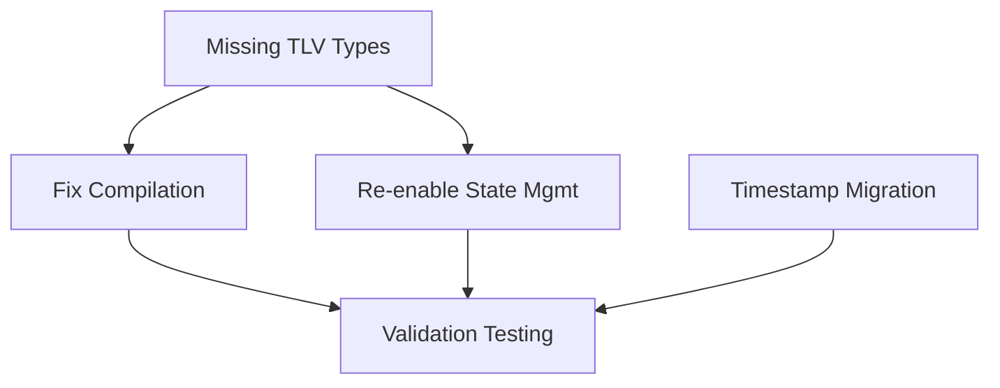

# Sprint 013.1: Critical Gap Resolution

**Duration**: 3-5 days (urgent fixes)
**Start Date**: 2025-08-26
**End Date**: 2025-08-30
**Status**: NOT_STARTED
**Priority**: 🔴 CRITICAL (blocks production deployment)

## Sprint Goals
1. **Resolve compilation errors** - Fix missing TLV types and import errors preventing system startup
2. **Re-enable safety features** - Restore disabled state management and invalidation functionality
3. **Complete timestamp migration** - Move timing logic to network transport layer for performance
4. **Validate production readiness** - Ensure zero data loss and <35μs hot path performance

## Task Summary
| Task ID | Description | Status | Priority | Hours |
|---------|-------------|--------|----------|-------|
| GAP-001 | Implement missing TLV types (QuoteTLV, InvalidationReason) | TODO | CRITICAL | 4 |
| GAP-002 | Fix binary compilation and import errors | TODO | CRITICAL | 3 |
| GAP-003 | Re-enable and fix state management functionality | TODO | CRITICAL | 4 |
| GAP-004 | Complete timestamp handling migration to network transport | TODO | HIGH | 2 |
| GAP-005 | End-to-end validation testing | TODO | HIGH | 2 |

**Total Effort**: 15 hours (3-5 days)

## Dependencies

### Internal Task Dependencies


### Sprint Dependencies
**Depends On**: 
- [x] Sprint 013: AUDIT-002, AUDIT-003, AUDIT-004 functionally complete
- [ ] libs/types protocol migration completed

**Provides For**:
- Production deployment readiness
- Sprint 014+: Further adapter migrations can proceed safely
- System-wide performance validation baseline

### Parallel Work Safe?
**⚠️ BLOCKS ALL OTHER WORK**: This sprint addresses critical production blockers

**⚠️ Conflicts With**:
- Any sprint modifying libs/types protocol structures
- Binary startup/compilation changes
- State management modifications

### Dependency Validation
```bash
# Before starting this sprint, verify:
# 1. Sprint 013 tasks AUDIT-002, AUDIT-003, AUDIT-004 are COMPLETE
# 2. All binary targets currently fail to compile (expected state)
# 3. State invalidation features are disabled (expected state)
# 4. No other sprints modifying core protocol types
```

## Definition of Done
- [ ] All GAP tasks marked COMPLETE
- [ ] All binary targets compile successfully (`cargo build --release`)
- [ ] No disabled production safety features remain
- [ ] Complete order book and state management functionality working
- [ ] Performance requirements met (<35μs hot path)
- [ ] Zero data loss scenarios validated
- [ ] Integration tests passing (documented in TEST_RESULTS.md)
- [ ] PR merged to main
- [ ] Production deployment unblocked

## Risk Mitigation
- **Risk 1**: TLV type conflicts with existing protocol → Mitigation: Use type registry validation, coordinate with protocol team
- **Risk 2**: Performance regression from new TLV types → Mitigation: Benchmark before/after, profile hot paths
- **Risk 3**: Breaking existing functionality during state management fixes → Mitigation: Comprehensive integration testing, gradual rollout
- **Risk 4**: Timestamp migration introduces new race conditions → Mitigation: Careful synchronization review, stress testing

## Daily Progress
### Day 1 - 2025-08-26
- [ ] GAP-001 started (Missing TLV types)
- [ ] Branch created: `fix/critical-gaps-sprint-013-1`
- Notes: Focus on QuoteTLV and InvalidationReason implementation first

### Day 2 - 2025-08-27
- [ ] GAP-001 complete
- [ ] GAP-002 started (Compilation fixes)
- Notes: Ensure all imports resolved and binary targets compile

### Day 3 - 2025-08-28
- [ ] GAP-002 complete
- [ ] GAP-003 started (Re-enable state management)
- [ ] GAP-004 started (Timestamp migration)
- Notes: Parallel work on state management and timestamp fixes

### Day 4 - 2025-08-29
- [ ] GAP-003 complete
- [ ] GAP-004 complete
- [ ] GAP-005 started (Validation testing)
- Notes: Focus on integration testing and performance validation

### Day 5 - 2025-08-30
- [ ] GAP-005 complete
- [ ] Final performance validation
- [ ] PR review and merge
- Notes: Production readiness verification complete