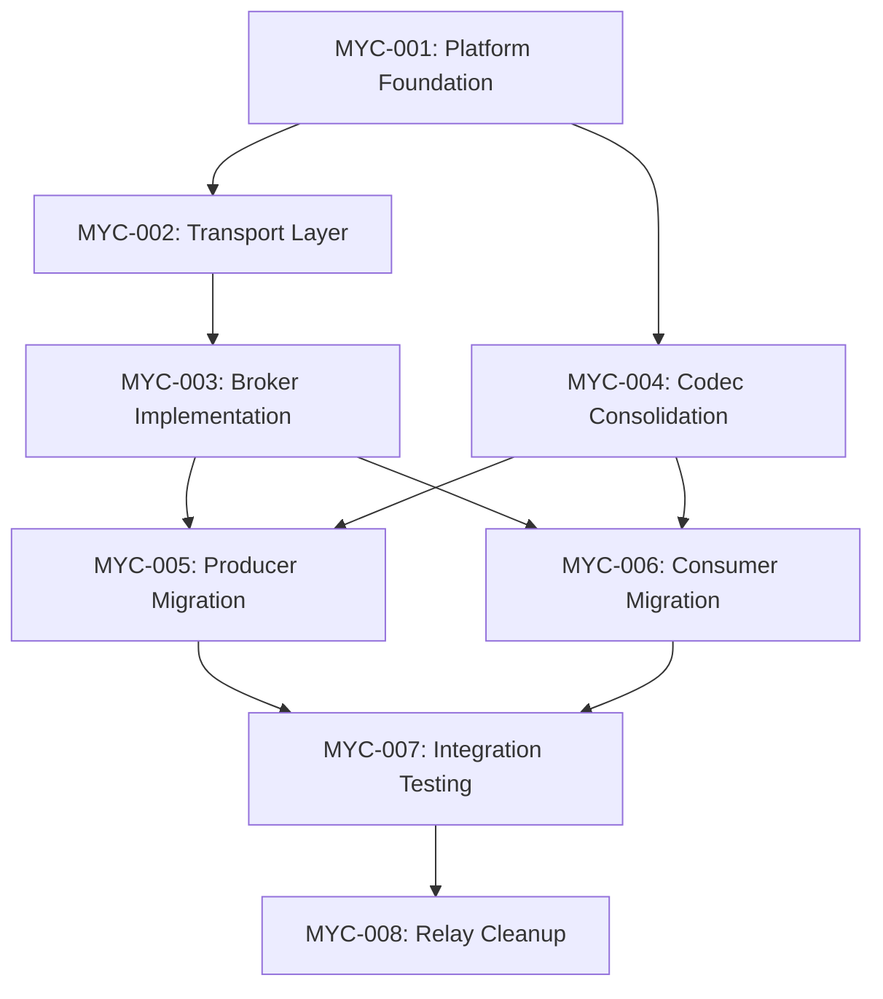

# Sprint-014: Mycelium Broker Integration

## Sprint Overview

**Objective**: Migrate Torq from relay-based architecture to direct Mycelium broker integration, eliminating the `relays/` directory and establishing clean separation between generic messaging infrastructure and trading logic.

**Duration**: 6-8 weeks  
**Priority**: High - Critical architecture evolution  
**Status**: Planning Phase

## Current State Analysis

### Existing Architecture Problems
```
┌─────────────────────┐    ┌──────────────────┐    ┌─────────────────┐
│   Producer Services │───▶│ Domain Relays    │───▶│ Consumer Services│
│  (market data,      │    │ - MarketDataRelay│    │ - Strategies     │
│   signals, exec)    │    │ - SignalRelay    │    │ - Portfolio      │
│                     │    │ - ExecutionRelay │    │ - Dashboard      │
└─────────────────────┘    └──────────────────┘    └─────────────────┘
```

**Issues with Current Relay Architecture**:
- **Redundant validation**: TLV parsing/validation happens in both producers and relays
- **Performance overhead**: Extra hop adds latency and resource usage
- **Coupling**: Relays are tightly coupled to Torq Protocol V2 specifics
- **Scalability limits**: Each relay domain requires separate process management
- **Maintenance burden**: Relay code is Torq-specific, not reusable

### Target Architecture Benefits
```
┌─────────────────────┐    ┌──────────────────┐    ┌─────────────────┐
│   Producer Services │───▶│   Mycelium       │───▶│ Consumer Services│
│  (collectors,       │    │   Broker         │    │ - Strategies     │
│   signals, exec)    │    │ (Generic Topics) │    │ - Portfolio      │
│                     │    │                  │    │ - Dashboard      │
└─────────────────────┘    └──────────────────┘    └─────────────────┘
```

**Advantages of Broker Architecture**:
- **Performance**: Eliminates relay hop, direct producer→consumer via broker
- **Separation**: Mycelium handles generic message routing, Torq handles trading logic
- **Scalability**: Topic-based routing scales horizontally
- **Reusability**: Mycelium broker can support other applications
- **Simplicity**: Fewer moving parts, cleaner service boundaries

## Architecture Transition Summary

### Phase 1: Foundation (MYC-001, MYC-002)
- Establish Mycelium as separate platform repository
- Implement transport layer with Unix socket and TCP support
- Define generic topic-based message routing (no Torq awareness)

### Phase 2: Broker Implementation (MYC-003, MYC-004)  
- Build broker with topic subscription/publishing
- Consolidate Torq codec into centralized library
- Remove Protocol V2 dependencies from transport layer

### Phase 3: Service Migration (MYC-005, MYC-006)
- Migrate producer services to use broker API directly
- Migrate consumer services to subscribe to broker topics
- Maintain Protocol V2 TLV message format end-to-end

### Phase 4: Validation & Cleanup (MYC-007, MYC-008)
- Comprehensive integration testing
- Performance validation (maintain >1M msg/s throughput)
- Remove relay directory and related infrastructure

## Success Criteria

### Performance Requirements (Must Maintain)
- **Message throughput**: >1M msg/s construction, >1.6M msg/s parsing
- **Latency**: <50μs additional latency compared to current relay architecture
- **Memory usage**: <100MB total broker memory footprint
- **CPU utilization**: <10% CPU overhead for broker processes

### Functional Requirements
- **Zero message loss**: All Protocol V2 TLV messages delivered reliably
- **Ordering preservation**: Maintain sequence integrity per source
- **Protocol compatibility**: Full Protocol V2 TLV support unchanged
- **Service isolation**: Producer/consumer failures don't affect broker
- **Configuration**: TOML-based broker and topic configuration

### Quality Requirements
- **Testing coverage**: >95% code coverage for broker components
- **Documentation**: Complete API documentation and migration guides
- **Monitoring**: Full observability for message flow and performance
- **Rollback capability**: Safe rollback to relay architecture if needed

## Risk Assessment

### High Risk Items
1. **Performance Regression**: Broker might introduce latency/throughput issues
   - *Mitigation*: Continuous benchmarking, zero-copy optimizations
   - *Detection*: Automated performance regression tests

2. **Message Loss During Migration**: Service interruption during cutover
   - *Mitigation*: Blue-green deployment, message buffering
   - *Detection*: Message sequence gap monitoring

3. **Topic Design Complexity**: Over-engineering generic topic routing
   - *Mitigation*: Start simple, iterate based on usage patterns
   - *Detection*: Code review focused on simplicity

### Medium Risk Items
1. **Configuration Management**: TOML configuration might be insufficient
   - *Mitigation*: Comprehensive configuration validation, clear error messages
   
2. **Service Coupling**: Services accidentally coupling to broker internals
   - *Mitigation*: Clear API boundaries, interface-based design

3. **Testing Complexity**: Integration testing across multiple services
   - *Mitigation*: Docker-compose test environments, automated test suites

### Low Risk Items
1. **Documentation Lag**: Documentation not keeping pace with implementation
2. **Performance Monitoring**: Gaps in observability during transition
3. **Developer Onboarding**: Learning curve for new architecture

## Sprint Timeline

### Week 1-2: Foundation & Transport
- **MYC-001**: Mycelium platform foundation setup
- **MYC-002**: Transport layer implementation

### Week 3-4: Broker Core & Codec
- **MYC-003**: Broker layer implementation  
- **MYC-004**: Torq codec consolidation

### Week 5-6: Service Migration
- **MYC-005**: Producer service migration
- **MYC-006**: Consumer service migration

### Week 7-8: Integration & Cleanup
- **MYC-007**: Integration testing and validation
- **MYC-008**: Legacy relay removal and cleanup

## Task Dependencies



## Performance Benchmarks

### Current Relay Performance (Baseline)
- **Market data relay**: 1.2M msg/s throughput, 35μs average latency
- **Signal relay**: 800K msg/s throughput, 42μs average latency  
- **Execution relay**: 500K msg/s throughput, 28μs average latency
- **Memory footprint**: 150MB total for all 3 relay processes

### Target Broker Performance
- **Combined throughput**: >1.2M msg/s (no regression from relay elimination)
- **Latency target**: <40μs end-to-end (producer→broker→consumer)
- **Memory target**: <100MB total broker footprint
- **CPU target**: <5% additional CPU overhead

### Monitoring Plan
- Continuous performance regression testing during migration
- Per-topic message rate and latency monitoring
- Memory and CPU utilization dashboards
- Automated alerts for performance degradation

## Architecture Decision Records

### ADR-001: Separate Mycelium Repository
**Decision**: Create Mycelium as standalone platform repository, not Torq subdirectory
**Rationale**: Enables reuse across projects, cleaner separation of concerns
**Implications**: Separate versioning, deployment, and maintenance cycles

### ADR-002: Topic-Based Routing (Not Domain-Based)
**Decision**: Use generic topic names, not Torq RelayDomain enum
**Rationale**: Enables generic message routing without trading-specific knowledge
**Implications**: Topic naming conventions must be established, migration complexity

### ADR-003: Maintain Protocol V2 TLV End-to-End
**Decision**: Keep TLV message format unchanged, consolidate parsing in services
**Rationale**: Preserve existing performance characteristics and message validation
**Implications**: Codec library becomes critical shared component

### ADR-004: TOML Configuration  
**Decision**: Use TOML for broker and topic configuration
**Rationale**: Human-readable, supports complex nested configuration, Rust ecosystem standard
**Implications**: Configuration validation becomes important, migration scripting needed

## Integration Points

### Service Integration Matrix
| Service Type | Current Relay | Target Broker Topic | Migration Complexity |
|--------------|---------------|-------------------|---------------------|
| Market Data Collectors | MarketDataRelay | `market.{venue}.{instrument}` | Medium |
| Signal Generators | SignalRelay | `signals.{strategy}.{asset}` | High |  
| Execution Services | ExecutionRelay | `execution.{venue}.{order}` | High |
| Portfolio Manager | All Relays | Subscribe to multiple topics | Medium |
| Dashboard | All Relays | Subscribe to multiple topics | Low |

### External Dependencies
- **Unix Socket Transport**: Required for low-latency local communication
- **TCP Transport**: Required for distributed deployment support
- **Message Sequencing**: Critical for gap detection and ordering
- **Configuration Management**: TOML parsing and validation
- **Monitoring Integration**: Metrics export for observability

## Testing Strategy

### Unit Testing
- Transport layer message serialization/deserialization
- Broker topic routing and subscription management
- Codec TLV parsing and validation
- Configuration loading and validation

### Integration Testing  
- Producer→Broker→Consumer message flow
- Multiple subscriber topic delivery
- Service failure and recovery scenarios
- Performance regression test suites

### End-to-End Testing
- Full system deployment with broker architecture
- Real market data flow through complete pipeline
- Strategy execution through broker routing
- Dashboard real-time updates via broker subscriptions

## Rollback Strategy

### Rollback Triggers
- Performance regression >20% from baseline
- Message loss or corruption detected
- Service instability or frequent crashes
- Integration complexity proves unmanageable

### Rollback Process
1. **Immediate**: Stop broker processes, restart relay processes
2. **Configuration**: Revert service configurations to relay endpoints
3. **Verification**: Confirm all services connected to relays properly
4. **Monitoring**: Validate message flow and performance return to baseline

### Rollback Testing
- Monthly rollback drills to ensure process works
- Automated rollback scripts and configuration management
- Clear rollback decision criteria and authorization process

## Post-Sprint Outcomes

### Expected Benefits
- **Simplified Architecture**: Fewer processes, clearer service boundaries
- **Performance Improvement**: Eliminate relay hop overhead
- **Better Scalability**: Topic-based routing enables horizontal scaling
- **Code Reuse**: Mycelium broker usable for other projects
- **Maintenance Reduction**: Less Torq-specific infrastructure code

### Metrics for Success Measurement
- **Development Velocity**: Time to add new market data sources
- **System Reliability**: Uptime and error rates
- **Resource Utilization**: CPU, memory, network usage
- **Developer Experience**: Time to onboard new team members

### Follow-up Initiatives
- **Sprint-015**: Mycelium broker clustering and high availability
- **Sprint-016**: Advanced topic routing and message filtering
- **Sprint-017**: Mycelium integration with other trading platforms
- **Sprint-018**: Performance optimization and zero-copy improvements

---

## Task Breakdown

- [MYC-001: Mycelium Platform Foundation](MYC-001_mycelium_platform_foundation.md)
- [MYC-002: Transport Layer Implementation](MYC-002_transport_layer_implementation.md)  
- [MYC-003: Broker Layer Implementation](MYC-003_broker_layer_implementation.md)
- [MYC-004: Torq Codec Consolidation](MYC-004_codec_consolidation.md)
- [MYC-005: Producer Service Migration](MYC-005_producer_service_migration.md)
- [MYC-006: Consumer Service Migration](MYC-006_consumer_service_migration.md)
- [MYC-007: Integration Testing and Validation](MYC-007_integration_testing_validation.md)
- [MYC-008: Legacy Relay Removal and Cleanup](MYC-008_legacy_relay_removal_cleanup.md)