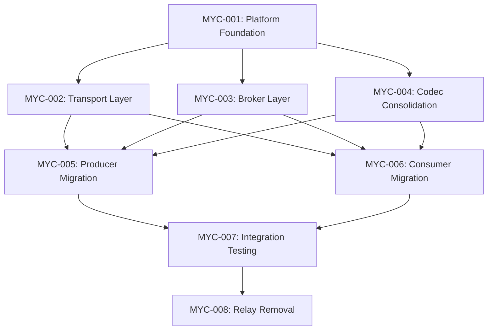

# Sprint 015: Mycelium Broker Integration

## Overview
Migrate from relay-based message routing to a direct broker architecture using Mycelium platform. This sprint removes the complex relay infrastructure and implements a simplified, high-performance message broker that maintains >1M msg/s throughput while reducing architectural complexity.

## Strategic Context
The current relay system (MarketDataRelay, SignalRelay, ExecutionRelay) adds unnecessary complexity with domain-specific routing logic. A generic broker with topic-based routing provides the same functionality with better maintainability and performance characteristics.

## Key Objectives

### Primary Goals
1. **Broker Architecture**: Implement Mycelium broker with fanout/queue routing patterns
2. **Performance Preservation**: Maintain >1M msg/s message throughput benchmarks
3. **Simplified Topology**: Replace 3 domain relays with 1 configurable broker
4. **Zero Downtime Migration**: Ensure seamless transition from relay to broker architecture
5. **Codec Consolidation**: Move all TLV validation logic to codec

### Secondary Goals
1. **Configuration Management**: TOML-based broker configuration system
2. **Transport Abstraction**: Generic transport layer supporting unix sockets
3. **Topic Management**: Flexible topic subscription and routing
4. **Monitoring Integration**: Preserve existing metrics and observability

## Architecture Transformation

### Current State (Relay-Based)
```
Producer Services → Domain Relays → Consumer Services
                    ├── MarketDataRelay (Types 1-19)
                    ├── SignalRelay (Types 20-39)
                    └── ExecutionRelay (Types 40-79)
```

### Target State (Broker-Based)
```
Producer Services → Mycelium Broker → Consumer Services
                    ├── Topic: market_data
                    ├── Topic: signals
                    └── Topic: execution
```

## Risk Assessment

### High Risk Areas
1. **Performance Regression**: New broker must maintain relay performance characteristics
2. **Message Loss**: Migration window could drop messages if not carefully orchestrated
3. **Consumer Disruption**: Strategy services must seamlessly transition to new subscription model
4. **Codec Fragmentation**: TLV parsing logic scattered across relay and codec libraries

### Mitigation Strategies
1. **Performance**: Benchmark broker against relay performance before migration
2. **Zero Downtime**: Implement blue-green deployment with message replay capability
3. **Backwards Compatibility**: Maintain relay interfaces during transition period
4. **Testing**: Comprehensive end-to-end tests with actual message flows

## Deliverables

### Core Infrastructure
- [ ] Mycelium platform repository with workspace configuration
- [ ] Transport layer with unix socket implementation
- [ ] Broker layer with topic-based routing
- [ ] Configuration system with TOML support

### Migration Components
- [ ] Consolidated codec with validation logic
- [ ] Migrated producer services (PolygonAdapter, etc.)
- [ ] Migrated consumer services (FlashArbitrage, etc.)
- [ ] Integration tests validating message flow

### Cleanup & Documentation
- [ ] Remove legacy relay directory and dependencies
- [ ] Update system documentation and architecture diagrams
- [ ] Performance validation maintaining >1M msg/s throughput

## Success Criteria

### Technical Validation
1. **Performance**: Broker maintains >1M msg/s construction, >1.6M msg/s parsing
2. **Functionality**: All producer→consumer message flows working
3. **Zero Data Loss**: No messages dropped during migration
4. **Clean Architecture**: No relay dependencies remaining in codebase

### Operational Validation
1. **Service Health**: All services start and maintain healthy state
2. **Monitoring**: Metrics and observability preserved
3. **Configuration**: Broker configurable via TOML files
4. **Rollback**: Clean rollback path if critical issues arise

## Task Dependencies



## Parallel Execution Strategy

### Phase 1: Foundation (Parallel)
- **MYC-001**: Platform setup (1 day)
- **MYC-004**: Codec consolidation (2 days) - can start immediately

### Phase 2: Infrastructure (Parallel)
- **MYC-002**: Transport layer (2 days) - depends on MYC-001
- **MYC-003**: Broker layer (3 days) - depends on MYC-001

### Phase 3: Migration (Parallel)
- **MYC-005**: Producer migration (2 days) - depends on MYC-002,003,004
- **MYC-006**: Consumer migration (2 days) - depends on MYC-002,003,004

### Phase 4: Validation & Cleanup (Sequential)
- **MYC-007**: Integration testing (3 days) - depends on MYC-005,006
- **MYC-008**: Relay removal (1 day) - depends on MYC-007

**Total Duration**: ~10 days with parallel execution, ~15 days sequential

## Performance Targets

### Message Throughput
- **Construction**: >1M msg/s (maintain current 1,097,624 msg/s)
- **Parsing**: >1.6M msg/s (maintain current 1,643,779 msg/s)
- **Routing**: <10μs broker routing latency
- **Transport**: <35μs unix socket roundtrip

### Resource Utilization
- **Memory**: <50MB per service (same as current)
- **CPU**: <20% during normal load
- **Connections**: Support 100+ concurrent consumer connections

## Rollback Plan

### Emergency Rollback (< 5 minutes)
1. Stop new broker services
2. Restart legacy relay services from previous deployment
3. Revert service configurations to relay endpoints
4. Monitor for service health restoration

### Gradual Rollback (< 30 minutes)
1. Deploy previous codebase version via git revert
2. Restart all services with original relay architecture
3. Validate message flows and performance metrics
4. Document rollback reason and required fixes

## Post-Migration Validation

### Functional Testing
- [ ] PolygonAdapter → Broker → FlashArbitrage message flow
- [ ] All TLV message types routed correctly
- [ ] Topic subscription/unsubscription working
- [ ] Configuration hot-reload functionality

### Performance Testing
- [ ] Broker throughput benchmarks
- [ ] End-to-end latency measurements
- [ ] Memory usage validation
- [ ] Connection scaling tests

### Operational Testing
- [ ] Service restart scenarios
- [ ] Broker crash/recovery behavior
- [ ] Configuration validation and error handling
- [ ] Monitoring and alerting verification