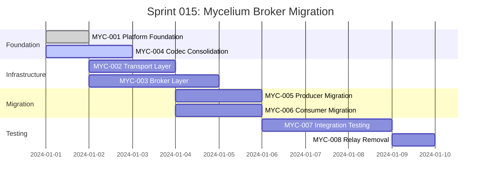

# Sprint 015: Mycelium Broker Integration - Sprint Plan

## Executive Summary

**Sprint Goal**: Migrate from relay-based message routing to Mycelium broker architecture while maintaining >1M msg/s throughput and zero-downtime transition.

**Duration**: 10 days (with parallel execution)
**Team Size**: 2-3 developers
**Risk Level**: Medium-High (performance and reliability critical)

## Sprint Objectives

### Primary Objectives (Must Have)
1. ✅ **Broker Infrastructure**: Complete Mycelium platform with transport and broker layers
2. ✅ **Producer Migration**: All producer services publishing to broker topics  
3. ✅ **Consumer Migration**: All consumer services subscribing to broker topics
4. ✅ **Performance Validation**: Maintain >1M msg/s construction, >1.6M msg/s parsing
5. ✅ **Zero Data Loss**: No messages lost during migration

### Secondary Objectives (Should Have)
1. 🎯 **Codec Consolidation**: Single TLV parsing/validation implementation
2. 🎯 **Configuration Management**: TOML-based broker configuration
3. 🎯 **Comprehensive Testing**: End-to-end integration and performance tests
4. 🎯 **Clean Architecture**: Remove all legacy relay code

### Stretch Goals (Could Have)
1. 📈 **Performance Optimization**: Exceed baseline throughput by 10%
2. 📊 **Enhanced Monitoring**: Detailed broker metrics and observability
3. 🔧 **Hot Configuration**: Runtime configuration updates without restart
4. 📚 **Documentation**: Complete architecture and deployment guides

## Task Breakdown and Timeline

### Week 1: Foundation and Infrastructure

#### Days 1-2: Foundation & Transport (Parallel)
- **MYC-001**: Mycelium Platform Foundation (1 day) - **BLOCKING**
- **MYC-004**: Codec Consolidation (2 days) - Can start immediately

#### Days 3-4: Core Infrastructure (Parallel)  
- **MYC-002**: Transport Layer (2 days) - Depends on MYC-001
- **MYC-003**: Broker Layer (3 days) - Depends on MYC-001, overlaps to day 5

### Week 2: Migration and Testing

#### Days 5-6: Service Migration (Parallel)
- **MYC-005**: Producer Migration (2 days) - Depends on MYC-002,003,004
- **MYC-006**: Consumer Migration (2 days) - Depends on MYC-002,003,004

#### Days 7-9: Integration and Validation
- **MYC-007**: Integration Testing (3 days) - Depends on MYC-005,006

#### Day 10: Cleanup
- **MYC-008**: Relay Removal (1 day) - Depends on successful MYC-007

## Parallel Execution Strategy

## Resource Allocation

### Developer 1 (Senior): Infrastructure Focus
- **Days 1-2**: MYC-001 Platform Foundation
- **Days 2-4**: MYC-003 Broker Layer (overlaps with codec work)
- **Days 7-9**: MYC-007 Integration Testing (performance focus)
- **Day 10**: MYC-008 Relay Removal

### Developer 2 (Senior): Migration Focus  
- **Days 1-3**: MYC-004 Codec Consolidation
- **Days 3-5**: MYC-002 Transport Layer
- **Days 5-7**: MYC-005 Producer Migration
- **Days 7-9**: MYC-007 Integration Testing (functional focus)

### Developer 3 (Mid-Level): Consumer Focus
- **Days 1-4**: Support codec consolidation and transport (code review, testing)
- **Days 5-7**: MYC-006 Consumer Migration
- **Days 7-9**: MYC-007 Integration Testing (edge cases, reliability)
- **Day 10**: Documentation and cleanup support

## Risk Assessment & Mitigation

### High-Risk Areas

#### Performance Regression (Risk: High)
- **Mitigation**: Continuous benchmarking during development
- **Contingency**: Rollback to relay system if performance drops >5%
- **Success Criteria**: ≥1M msg/s construction, ≥1.6M msg/s parsing

#### Message Loss During Migration (Risk: Medium)
- **Mitigation**: Blue-green deployment with message replay capability  
- **Contingency**: Parallel operation of relay and broker during transition
- **Success Criteria**: Zero message loss validated by end-to-end tests

#### Integration Complexity (Risk: Medium)
- **Mitigation**: Incremental migration service-by-service
- **Contingency**: Extended testing period if integration issues arise
- **Success Criteria**: All services connect and communicate correctly

### Medium-Risk Areas

#### Configuration Management (Risk: Medium)
- **Mitigation**: Start with simple configurations, add complexity gradually
- **Contingency**: Hard-coded configurations if TOML parsing issues

#### Transport Layer Reliability (Risk: Medium) 
- **Mitigation**: Extensive connection failure testing
- **Contingency**: Fall back to TCP if unix socket issues arise

#### Codec Consolidation Bugs (Risk: Medium)
- **Mitigation**: Comprehensive validation against existing relay parsing
- **Contingency**: Keep compatibility layer longer if issues found

### Low-Risk Areas
- Topic routing logic (well-understood pattern)
- Service configuration updates (straightforward changes)
- Documentation updates (non-blocking)

## Success Criteria

### Functional Requirements
- [ ] All producer services publish to broker topics successfully
- [ ] All consumer services subscribe and receive messages correctly
- [ ] Message content identical to relay-based system
- [ ] Service startup/shutdown sequences work properly
- [ ] Configuration hot-reload functional (if implemented)

### Performance Requirements
- [ ] **Throughput**: ≥1M msg/s construction, ≥1.6M msg/s parsing
- [ ] **Latency**: <100μs end-to-end for typical message sizes
- [ ] **Memory**: No increase in per-service memory usage
- [ ] **CPU**: No significant increase in CPU utilization
- [ ] **Scaling**: Support same concurrent connection count as relays

### Reliability Requirements
- [ ] **Zero Data Loss**: No messages lost during normal operation
- [ ] **Failure Recovery**: Graceful handling of connection failures
- [ ] **Service Isolation**: Producer/consumer failures don't affect broker
- [ ] **Restart Resilience**: Services reconnect automatically after restart

### Quality Requirements
- [ ] **Code Coverage**: >85% test coverage for new broker code
- [ ] **Documentation**: Complete API and architecture documentation
- [ ] **Monitoring**: Preserve existing metrics and observability
- [ ] **Clean Architecture**: No relay dependencies remaining

## Daily Standup Focus

### Week 1 Focus Questions
- Is the Mycelium platform foundation complete and stable?
- Are transport and broker layers meeting performance targets?
- Is codec consolidation preserving all existing functionality?
- Are there any blocking issues preventing parallel development?

### Week 2 Focus Questions
- Are producer/consumer migrations preserving message integrity?
- What integration test results do we have so far?
- Are performance benchmarks meeting requirements?
- Any issues that could delay the relay removal?

## Go/No-Go Decision Points

### Day 4 Checkpoint: Infrastructure Ready
**Criteria for Proceeding**:
- [ ] Broker handles basic publish/subscribe operations
- [ ] Transport layer supports concurrent connections
- [ ] Performance baseline meets targets (preliminary)
- [ ] No critical architectural issues discovered

**If No-Go**: Extend infrastructure phase, reduce scope of migration

### Day 6 Checkpoint: Migration Feasible
**Criteria for Proceeding**:
- [ ] At least one producer successfully migrated
- [ ] At least one consumer successfully migrated
- [ ] Message flow validated end-to-end
- [ ] No show-stopping integration issues

**If No-Go**: Parallel operation of relay and broker systems

### Day 9 Checkpoint: Ready for Cleanup
**Criteria for Proceeding**:
- [ ] All integration tests passing
- [ ] Performance requirements met consistently
- [ ] Zero message loss validated
- [ ] System stable under load

**If No-Go**: Keep relay code as backup, extend validation period

## Sprint Deliverables

### Code Deliverables
1. **Mycelium Platform Repository** - Complete workspace with transport, broker, config crates
2. **Updated Producer Services** - All adapters publishing to broker topics
3. **Updated Consumer Services** - All strategies/services subscribing to topics
4. **Consolidated Codec** - Single TLV parsing/validation implementation
5. **Integration Test Suite** - Comprehensive end-to-end and performance tests

### Documentation Deliverables
1. **Architecture Documentation** - Updated diagrams and technical specifications
2. **Deployment Guide** - Step-by-step migration and operation instructions
3. **Configuration Reference** - Complete TOML configuration documentation
4. **Performance Report** - Benchmark results and optimization recommendations
5. **Migration Playbook** - Lessons learned and best practices

### Infrastructure Deliverables
1. **Broker Configuration** - Production-ready TOML configurations
2. **Monitoring Integration** - Metrics collection and alerting setup
3. **Health Check Scripts** - System health validation automation
4. **Deployment Scripts** - Automated deployment and rollback procedures

## Post-Sprint Activities

### Immediate Follow-ups (Week 3)
- [ ] Performance tuning based on production load patterns
- [ ] Additional monitoring and alerting setup
- [ ] Documentation review and updates
- [ ] Team retrospective and lessons learned

### Medium-term Follow-ups (Month 1)
- [ ] Enhanced broker features (message persistence, dead letter queues)
- [ ] Advanced configuration management (environment-specific configs)
- [ ] Performance optimization based on real-world usage
- [ ] Additional transport implementations (TCP, WebSocket)

### Long-term Follow-ups (Quarter 1)
- [ ] Message ordering guarantees if needed
- [ ] Multi-broker federation for scaling
- [ ] Advanced routing patterns (content-based routing)
- [ ] Integration with external message systems

## Communication Plan

### Sprint Updates
- **Daily Standups**: 9:00 AM, focus on blockers and dependencies
- **Mid-sprint Review**: Day 5, assess progress and adjust timeline
- **Sprint Review**: Day 10, demonstrate completed functionality
- **Sprint Retrospective**: Day 11, identify improvements for future sprints

### Stakeholder Communication
- **Weekly Status**: Summary to product and engineering leadership
- **Risk Escalation**: Immediate notification for any go/no-go concerns
- **Performance Reports**: Daily performance metrics during critical phases
- **Final Report**: Complete migration summary with metrics and recommendations

This sprint plan provides a comprehensive roadmap for migrating to the Mycelium broker architecture while maintaining the high performance and reliability standards required by the Torq system.