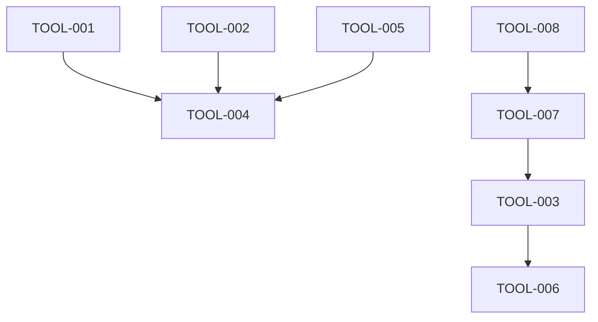

# Sprint 016: Enhanced Development Workflow and Tooling Infrastructure

**Duration**: 5 days
**Start Date**: 2025-01-27
**End Date**: 2025-01-31
**Status**: NOT_STARTED

## Sprint Goals
1. **Implement missing standard Rust tooling**: Add cargo-deny, cargo-udeps, cargo-sort to CI/CD pipeline for comprehensive dependency management and security auditing
2. **Enhance pattern enforcement**: Create custom scripts to detect architectural violations specific to Torq (precision handling, direct transport usage, TLV patterns)
3. **Centralize development practices**: Create `.claude/docs/practices.md` as the canonical reference for development patterns and architectural invariants
4. **Improve developer feedback loop**: Enhance pre-commit hooks and add automated detection of common violations
5. **Restructure documentation**: Improve .claude/docs modularity with consistent naming and .claude/agents consolidation
6. **Success metrics**: 100% CI/CD coverage for standard Rust tools, zero false positives in pattern detection, complete practices documentation, improved documentation organization

## Task Summary
| Task ID | Description | Status | Priority | Hours |
|---------|-------------|--------|----------|-------|
| TOOL-001 | Implement standard Rust tooling (cargo-deny, cargo-udeps, cargo-sort) | TODO | CRITICAL | 3 |
| TOOL-002 | Create pattern enforcement scripts for architectural violations | TODO | HIGH | 4 |
| TOOL-003 | Create comprehensive practices documentation | TODO | HIGH | 3 |
| TOOL-004 | Enhance pre-commit hooks with new tooling integration | TODO | MEDIUM | 2 |
| TOOL-005 | Add automated detection of precision/float violations | TODO | HIGH | 3 |
| TOOL-006 | Create development workflow validation scripts | TODO | MEDIUM | 2 |
| TOOL-007 | Restructure .claude/docs for better modularity and consistency | TODO | MEDIUM | 2 |
| TOOL-008 | Consolidate .claude/agents documentation (scrum-leader files) | TODO | LOW | 1 |

## Dependencies

### Internal Task Dependencies


### Sprint Dependencies
**Depends On**: 
- No specific sprint dependencies - this is infrastructure work

**Provides For**:
- All future sprints: Enhanced code quality and consistency enforcement
- Development productivity: Faster feedback loops and automated violation detection

### Parallel Work Safe?
**✅ Can Run Concurrently With**:
- Sprint 015: No shared components, different architectural layers
- Any feature development sprints: This is pure tooling/infrastructure

**⚠️ Conflicts With**:
- None identified - tooling changes are additive

### Dependency Validation
```bash
# Before starting this sprint, verify:
# 1. CI/CD pipeline is functional
# 2. Git hooks directory exists (.git/hooks)
# 3. Rust toolchain is up to date
cargo --version
rustc --version
```

## Definition of Done
- [ ] All tasks marked COMPLETE
- [ ] Tests passing (documented in TEST_RESULTS.md)
- [ ] CI/CD pipeline includes all new tools
- [ ] Pre-commit hooks enhanced with new validations
- [ ] Practices documentation complete and accessible
- [ ] No performance regressions in build/test times
- [ ] All pattern enforcement scripts working with zero false positives

## Risk Mitigation
- **Risk 1**: CI/CD build time increase from additional tools → Mitigation: Implement caching strategies, run some checks only on PR
- **Risk 2**: False positives in pattern detection scripts → Mitigation: Thorough testing with existing codebase, whitelist mechanism
- **Risk 3**: Developer friction from stricter checks → Mitigation: Clear documentation, helpful error messages, gradual rollout

## Architecture Context
This sprint focuses on **developer experience and code quality infrastructure**. Key areas:

### Missing Standard Rust Tools
- **cargo-deny**: License compliance, security advisories, dependency policies
- **cargo-udeps**: Unused dependency detection for clean Cargo.toml files
- **cargo-sort**: Consistent Cargo.toml formatting and organization

### Torq-Specific Pattern Enforcement
- Direct `UnixSocketTransport::new` usage detection (should use factory patterns)
- `define_tlv!` macro usage validation (proper TLV type number assignment)
- Float/double precision handling in financial contexts (enforce fixed-point)
- Redundant implementation detection (code that should use shared libs)

### Documentation Consolidation
- Central practices reference from scattered CLAUDE.md patterns
- Clear architectural invariant documentation
- Developer onboarding materials with specific Torq patterns

## Daily Progress
### Day 1 - 2025-01-27
- [ ] TOOL-001 started: Implement standard Rust tooling
- [ ] Branch created: `feat/enhanced-rust-tooling`
- Notes: Focus on cargo-deny configuration and CI integration

### Day 2 - 2025-01-28
- [ ] TOOL-001 complete: CI/CD integrated with new tools
- [ ] TOOL-002 started: Pattern enforcement scripts
- Notes: Test with existing codebase to ensure no false positives

### Day 3 - 2025-01-29
- [ ] TOOL-002 complete: Pattern detection working
- [ ] TOOL-003 started: Practices documentation
- [ ] TOOL-005 started: Precision violation detection
- Notes: Focus on clarity and usability of documentation

### Day 4 - 2025-01-30
- [ ] TOOL-003 complete: Documentation comprehensive
- [ ] TOOL-004 started: Enhanced pre-commit hooks
- [ ] TOOL-005 complete: Float detection working
- Notes: Integration testing of all tools together

### Day 5 - 2025-01-31
- [ ] TOOL-004 complete: Pre-commit hooks enhanced
- [ ] TOOL-006 started and complete: Workflow validation
- [ ] Final testing and validation
- [ ] PR review and merge
- Notes: Ensure no disruption to existing workflows

## Success Criteria

### Functional Requirements
1. **Standard Tool Integration**: cargo-deny, cargo-udeps, cargo-sort working in CI
2. **Pattern Detection**: Zero false positives, catches real violations
3. **Documentation Quality**: Clear, actionable practices reference
4. **Developer Experience**: Enhanced feedback, clear error messages

### Non-Functional Requirements
1. **Performance**: Build time increase <30 seconds
2. **Reliability**: Tools work consistently across different environments
3. **Maintainability**: Scripts are well-documented and configurable
4. **Usability**: Clear instructions for local development setup

### Acceptance Criteria
- All new tools pass on existing codebase without changes needed
- Pattern enforcement catches known anti-patterns in test cases
- Practices documentation covers all critical Torq patterns
- Pre-commit hooks provide helpful feedback for common issues
- CI/CD pipeline remains stable with new tool integration