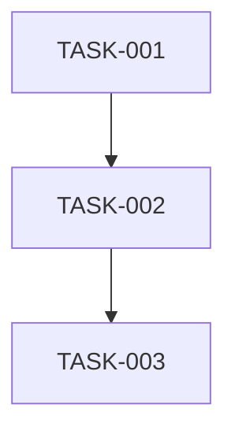

# Sprint 999: test-verification

**Duration**: 5 days
**Start Date**: YYYY-MM-DD
**End Date**: YYYY-MM-DD
**Status**: NOT_STARTED

## Sprint Goals
1. [Primary objective - what will be achieved]
2. [Secondary objectives if any]
3. [Success metrics]

## Task Summary
| Task ID | Description | Status | Priority | Hours |
|---------|-------------|--------|----------|-------|
| TASK-001 | [Description] | TODO | CRITICAL | 3 |
| TASK-002 | [Description] | TODO | HIGH | 2 |
| TASK-003 | [Description] | TODO | MEDIUM | 4 |

## Dependencies

### Internal Task Dependencies


### Sprint Dependencies
**Depends On**: 
- [ ] Sprint 999: [Specific requirement from previous sprint]
- [ ] Sprint YYY: [Another dependency]

**Provides For**:
- Sprint ZZZ: [What this sprint enables for future work]
- Sprint AAA: [Another output dependency]

### Parallel Work Safe?
**✅ Can Run Concurrently With**:
- Sprint 999: No shared components
- Sprint YYY: Different architectural layers

**⚠️ Conflicts With**:
- Sprint ZZZ: Both modify same core files
- Sprint AAA: Requires sequential completion

### Dependency Validation
```bash
# Before starting this sprint, verify:
# 1. All prerequisite sprints marked COMPLETE
# 2. No conflicting sprints are IN_PROGRESS
# 3. Required infrastructure/APIs available
```

## Definition of Done
- [ ] All tasks marked COMPLETE
- [ ] Tests passing (documented in TEST_RESULTS.md)
- [ ] PR merged to main
- [ ] No performance regressions
- [ ] Documentation updated

## Risk Mitigation
- **Risk 1**: [Description] → Mitigation: [Strategy]
- **Risk 2**: [Description] → Mitigation: [Strategy]

## Daily Progress
### Day 1 - [Date]
- [ ] TASK-001 started
- [ ] Branch created
- Notes: 

### Day 2 - [Date]
- [ ] TASK-001 complete
- [ ] TASK-002 started
- Notes:

### Day 3 - [Date]
- [ ] TASK-002 complete
- [ ] TASK-003 started
- Notes:

### Day 4 - [Date]
- [ ] TASK-003 complete
- [ ] Integration testing
- Notes:

### Day 5 - [Date]
- [ ] Final testing
- [ ] PR review and merge
- Notes: