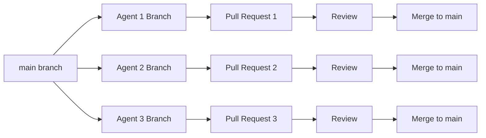

# Agent Git Workflow - Complete Guide

## 🎯 Overview: Each Agent Works Independently

Each agent gets their own complete copy of the repository, works in isolation, and creates a PR for review before merging.



## 📚 Complete Agent Workflow

### Step 1: Agent Receives Task
```bash
# You provide the agent with their task
"Please read and implement the task in:
.claude/tasks/pool-address-fix/POOL-001_cache_structure.md"
```

### Step 2: Agent Creates Their Own Working Tree
```bash
# Agent ensures they have latest main
git checkout main
git pull origin main

# Agent creates their feature branch
git checkout -b fix/pool-cache-integration

# Verify correct branch
git branch --show-current
# Output: fix/pool-cache-integration
```

### Step 3: Agent Implements Solution
```bash
# Agent works on their task
# - Modifies files according to specification
# - Runs tests locally
# - Commits changes frequently

# Example commits during work:
git add services_v2/adapters/src/polygon/polygon.rs
git commit -m "feat(pool): add pool cache dependency"

git add services_v2/adapters/Cargo.toml
git commit -m "feat(pool): integrate pool cache into collector"

# Agent can make multiple commits
git log --oneline
# Shows: multiple incremental commits
```

### Step 4: Agent Pushes Branch to Remote
```bash
# Push the branch to GitHub/remote
git push -u origin fix/pool-cache-integration

# Output:
# * [new branch]      fix/pool-cache-integration -> fix/pool-cache-integration
# Branch 'fix/pool-cache-integration' set up to track 'origin/fix/pool-cache-integration'
```

### Step 5: Agent Creates Pull Request
```bash
# Option A: Using GitHub CLI (if available)
gh pr create \
  --title "POOL-001: Integrate existing pool cache" \
  --body "$(cat .claude/tasks/pool-address-fix/POOL-001_PR.md)" \
  --base main

# Option B: Agent provides you the command
"I've pushed my branch. Please create a PR with:
  From: fix/pool-cache-integration
  To: main
  Title: POOL-001: Integrate existing pool cache"
```

### Step 6: You Review the PR
```bash
# You can review the PR locally
gh pr checkout [PR-NUMBER]
# OR
git fetch origin
git checkout -b review-pool-001 origin/fix/pool-cache-integration

# Run tests
cargo test --package services_v2
cargo bench --package services_v2

# Review changes
git diff main..HEAD

# Check specific files
git diff main..HEAD -- services_v2/adapters/src/polygon/polygon.rs
```

### Step 7: Request Changes (If Needed)
```bash
# If changes needed, comment on PR
gh pr comment [PR-NUMBER] --body "Please fix the following:
1. Missing error handling in line 234
2. Need to add unit test for cache miss scenario"

# Agent makes fixes on same branch
git add -A
git commit -m "fix(pool): address PR review comments"
git push

# PR automatically updates
```

### Step 8: Approve and Merge
```bash
# Once satisfied, approve and merge
gh pr review [PR-NUMBER] --approve
gh pr merge [PR-NUMBER] --squash --delete-branch

# OR manually:
git checkout main
git pull origin main
git merge --squash origin/fix/pool-cache-integration
git commit -m "feat(pool): integrate pool cache (POOL-001) (#PR-NUMBER)"
git push origin main
```

## 🔄 Parallel Agent Workflow

### Multiple Agents Working Simultaneously

**Terminal 1 - Agent A (POOL-001)**
```bash
git checkout main && git pull
git checkout -b fix/pool-cache-integration
# ... works on task ...
git push -u origin fix/pool-cache-integration
# Creates PR #101
```

**Terminal 2 - Agent B (PRECISION-001)**
```bash
git checkout main && git pull
git checkout -b fix/signal-precision-loss
# ... works on task ...
git push -u origin fix/signal-precision-loss
# Creates PR #102
```

**Terminal 3 - Agent C (PERF-001)**
```bash
git checkout main && git pull
git checkout -b fix/checksum-sampling
# ... works on task ...
git push -u origin fix/checksum-sampling
# Creates PR #103
```

**You Review All PRs**
```bash
# List all open PRs
gh pr list

# Review each
gh pr view 101
gh pr view 102
gh pr view 103

# Merge in order of dependencies
gh pr merge 101 --squash  # POOL-001 first (no deps)
gh pr merge 102 --squash  # PRECISION-001 (no deps)
gh pr merge 103 --squash  # PERF-001 (no deps)
```

## 📋 Agent Checklist Template

Each agent should follow this checklist:

```markdown
## Pre-Implementation
- [ ] Read task specification completely
- [ ] Checkout main and pull latest
- [ ] Create feature branch
- [ ] Understand acceptance criteria

## During Implementation
- [ ] Follow code style guidelines
- [ ] Write/update tests
- [ ] Add documentation
- [ ] Commit frequently with clear messages

## Pre-PR Checklist
- [ ] All tests passing locally
- [ ] No merge conflicts with main
- [ ] Code follows conventions
- [ ] Performance targets met

## PR Creation
- [ ] Push branch to remote
- [ ] Create PR with template
- [ ] Link to task ID
- [ ] Request review

## Post-Review
- [ ] Address all feedback
- [ ] Push fixes to same branch
- [ ] Confirm PR updates
- [ ] Wait for approval
```

## 🎯 Benefits of This Workflow

1. **Isolation**: Each agent works independently, no conflicts
2. **Review Gate**: You review everything before it touches main
3. **Rollback**: Easy to reject or revert individual PRs
4. **History**: Clear commit history with PR references
5. **Learning**: Agents learn proper git collaboration

## 🚦 Review Criteria

When reviewing agent PRs, check:

### Code Quality
- [ ] Solves the specified problem
- [ ] No placeholder code ([0u8; 20])
- [ ] Proper error handling
- [ ] No unwrap() in production code

### Performance
- [ ] Meets <35μs hot path requirement
- [ ] No blocking operations
- [ ] Efficient memory usage

### Testing
- [ ] Unit tests included/updated
- [ ] Integration tests pass
- [ ] No regression in benchmarks

### Documentation
- [ ] Code comments where needed
- [ ] Updated relevant docs
- [ ] Clear commit messages

## 🔧 Handling Merge Conflicts

If an agent encounters conflicts after another PR merges:

```bash
# Agent updates their branch
git fetch origin
git rebase origin/main

# Resolve conflicts
# ... edit conflicted files ...
git add -A
git rebase --continue

# Force push (safe for feature branches)
git push --force-with-lease

# PR automatically updates
```

## 📊 Tracking Progress

Monitor all agent work:

```bash
# See all branches
git branch -r | grep fix/

# See all PRs
gh pr list --state all

# Check specific agent progress
git log origin/fix/pool-cache-integration --oneline

# See who's working on what
gh pr list --assignee @me
```

## 🎉 Completion

Once all PRs merged:
```bash
# Verify all fixes in main
git checkout main
git pull origin main
git log --oneline -10

# Run full test suite
cargo test --workspace
cargo bench

# Tag the release
git tag -a v1.0.0-fixes -m "Critical production fixes"
git push origin v1.0.0-fixes
```

---

## Example Agent Instructions

When starting an agent, provide:

```
You are a specialist agent working on task POOL-001.

1. Read the task: .claude/tasks/pool-address-fix/POOL-001_cache_structure.md
2. Follow the git workflow in AGENT_WORKFLOW.md
3. Create your branch: fix/pool-cache-integration
4. Implement the solution
5. Push your branch and report back with PR details
6. Your work will be reviewed before merging

Do not merge to main directly. Work only in your feature branch.
```

---

*This workflow ensures quality control while enabling parallel development!*
