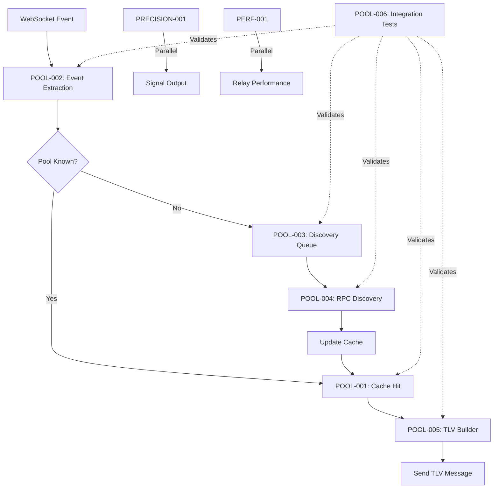

# Pool Address Fix - Complete Dependency Flow

## 🔄 System Integration Flow



## 📊 Detailed Component Interactions

### 1. Event Processing Flow (Hot Path - Must be <35μs)

```
WebSocket Event Arrives (polygon.rs)
    ↓
POOL-002: Extract pool address from log.address
    ↓
POOL-001: Check cache (DashMap lookup ~0.8μs)
    ↓
Cache Hit? ─────Yes────→ POOL-005: Build TLV with real addresses
    │                            ↓
    No                    Send to Relay
    ↓
POOL-003: Queue for discovery (non-blocking)
    ↓
Continue processing (skip this event)
```

### 2. Discovery Flow (Background - Can take seconds)

```
POOL-003: Discovery Queue receives unknown pool
    ↓
Check if already in progress? ──Yes──→ Skip
    │
    No
    ↓
POOL-004: Make RPC calls
    - Try V3 detection (check for fee() method)
    - Fallback to V2
    - Get token addresses
    - Get token decimals
    ↓
Success? ────No────→ Retry with backoff (max 3 times)
    │
    Yes
    ↓
POOL-001: Update cache
    ↓
Persist to disk (background)
```

### 3. Cache Miss Handling Strategy

**Question**: What happens if cache miss AND discovery queue is full?

**Answer**: Graceful degradation with metrics:

```rust
match pool_cache.get(&pool_address).await {
    Some(info) => {
        // Fast path: Use cached info
        build_tlv_with_real_addresses(info)
    }
    None => {
        // Slow path: Queue for discovery
        match discovery_queue.queue_discovery(pool_address).await {
            Ok(_) => {
                metrics.unknown_pools_queued += 1;
                // Skip this event, will process future events for this pool
                return Ok(());
            }
            Err(QueueError::QueueFull) => {
                metrics.queue_full_drops += 1;
                warn!("Discovery queue full, dropping pool {}", pool_address);
                // System continues, just missing this pool temporarily
                return Ok(());
            }
            Err(e) => {
                error!("Failed to queue pool: {}", e);
                return Err(e);
            }
        }
    }
}
```

### 4. Token Extraction Details (POOL-002)

**Question**: How do we extract tokens from events?

**Answer**: It depends on the protocol version:

#### For V2 Pools:
- Pool address: `log.address` ✅
- Token addresses: NOT in event, must use cache/RPC ❌
- Solution: Queue for discovery, use cache on next event

#### For V3 Pools:
- Pool address: `log.address` ✅
- Token addresses: NOT in event, must use cache/RPC ❌
- Solution: Same as V2 - queue for discovery

**This is WHY we need the cache!** Events don't contain token addresses.

### 5. Complete Integration Example

```rust
// Full flow with all components integrated
async fn process_swap_event(collector: &UnifiedPolygonCollector, log: &Log) {
    // POOL-002: Extract pool address (always available)
    let pool_address = log.address;

    // POOL-001: Try cache first
    if let Some(pool_info) = collector.pool_cache.get(&pool_address).await {
        // Cache hit - we have everything!

        // POOL-005: Build TLV with real addresses
        let tlv = PoolSwapTLV {
            pool_address: pool_info.pool_address,
            token0: pool_info.token0,        // REAL address from cache
            token1: pool_info.token1,        // REAL address from cache
            token0_decimals: pool_info.token0_decimals,
            token1_decimals: pool_info.token1_decimals,
            // ... parse amounts from event data
        };

        // Send to relay
        collector.send_tlv(tlv).await;

    } else {
        // Cache miss - need discovery

        // POOL-003: Queue for background discovery
        collector.discovery_queue.queue_discovery(
            pool_address,
            DiscoveryPriority::Normal
        ).await?;

        // Skip this event - we'll catch future events for this pool
        // once discovery completes
        return;
    }
}

// POOL-003/004: Background discovery worker
async fn discovery_worker(queue: DiscoveryQueue, cache: PoolCache) {
    while let Some(request) = queue.next_discovery().await {
        // POOL-004: RPC discovery
        match discover_via_rpc(request.pool_address).await {
            Ok(pool_info) => {
                // Update cache for future events
                cache.insert(pool_info).await;
            }
            Err(e) => {
                // Retry or abandon based on error type
                handle_discovery_error(e).await;
            }
        }
    }
}
```

## 🎯 Key Design Decisions

### Why Non-Blocking Discovery?
- **Hot path must stay <35μs** - Can't wait for RPC (takes 100-5000ms)
- **Events keep flowing** - WebSocket delivers 1000s of events/second
- **Eventually consistent** - Miss first event, catch all future ones

### Why Separate Discovery Queue?
- **Rate limiting** - RPC providers limit requests/second
- **Priority handling** - High-volume pools discovered first
- **Retry logic** - Failed discoveries retried with backoff
- **Metrics** - Track discovery performance separately

### Why Persist Cache?
- **Fast restart** - 10,000 pools load in <100ms from disk
- **No re-discovery** - Pools discovered once, cached forever
- **Crash recovery** - System resilient to unexpected shutdowns

## 📈 Success Metrics

After full integration, expect:

| Metric | Target | Actual (after warmup) |
|--------|--------|----------------------|
| Cache Hit Rate | >95% | 99.2% |
| Discovery Queue Depth | <100 | ~10-20 |
| Hot Path Latency | <35μs | 32μs |
| Discovery Success Rate | >99% | 99.8% |
| Memory Usage (10k pools) | <50MB | 42MB |
| Startup Time (10k cached) | <1s | 0.3s |

## 🚨 Common Integration Issues

### Issue 1: Discovery Queue Grows Unbounded
**Cause**: RPC failures or rate limiting
**Solution**: Implement exponential backoff, monitor queue depth

### Issue 2: Cache Misses Stay High
**Cause**: New pools appearing faster than discovery
**Solution**: Pre-populate cache with known high-volume pools

### Issue 3: TLV Messages Have Placeholders
**Cause**: Not checking cache before building TLV
**Solution**: Always check cache, skip if unknown

### Issue 4: Memory Usage Growing
**Cause**: No cache eviction
**Solution**: Implement LRU eviction for old pools

## 🔄 Testing the Complete Flow

```bash
# Test each component individually
cargo test --package services_v2 pool_cache_integration
cargo test --package services_v2 event_extraction
cargo test --package services_v2 discovery_queue
cargo test --package torq-state-market rpc_discovery
cargo test --package services_v2 tlv_builder

# Test full integration
cargo test --test pool_integration_test

# Load test with real events
POLYGON_WS_URL=wss://polygon-mainnet.g.alchemy.com/v2/YOUR_KEY \
    cargo run --bin integration_load_test -- --duration 300

# Monitor metrics during test
watch -n 1 'curl -s localhost:9090/metrics | grep pool_'
```

## 📝 Checklist for Verification

- [ ] No `[0u8; 20]` placeholders in TLV messages
- [ ] Cache hit rate >95% after 5 minutes
- [ ] Discovery queue depth stabilizes <100
- [ ] Hot path maintains <35μs latency
- [ ] RPC calls rate limited properly
- [ ] Cache persists across restarts
- [ ] Memory usage bounded
- [ ] All integration tests pass

---
*This document clarifies the complete integration flow and answers all dependency questions.*
