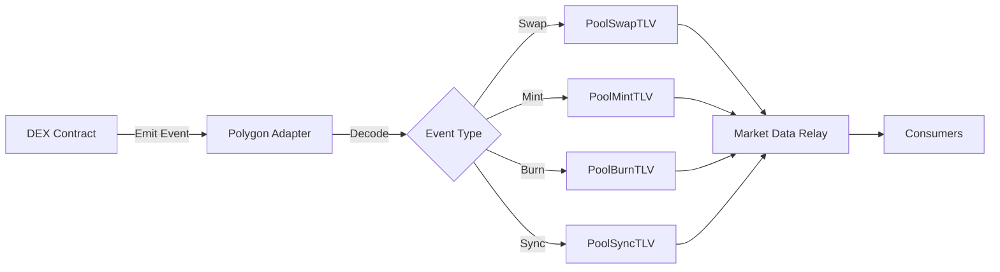

# EVENTS-001: Process All DEX Events

## Task Overview
**Sprint**: 003-data-integrity
**Priority**: MEDIUM - INCOMPLETE STATE TRACKING
**Estimate**: 6 hours
**Status**: COMPLETE
**Issue**: Only processing Swaps, missing 75% of pool state changes

## Problem
System only processes Swap events, completely ignoring Mint (liquidity add), Burn (liquidity remove), and Sync (reserve update) events. This means our pool state is always wrong.

## Files to Modify
- `services_v2/adapters/src/bin/polygon/polygon.rs` - Add event processing
- `services_v2/adapters/src/bin/polygon/relay_consumer.rs` - Handle new TLVs
- `protocol_v2/src/tlv/types.rs` - Ensure TLV types exist

## Current State (INCOMPLETE)
```rust
// Only processing swaps!
match event {
    PoolEvent::Swap(swap) => process_swap(swap),
    PoolEvent::Mint(_) => {} // IGNORED!
    PoolEvent::Burn(_) => {} // IGNORED!
    PoolEvent::Sync(_) => {} // IGNORED!
}
```

## Required Implementation

### Step 1: Add Event Processing in Polygon Adapter
```rust
// polygon.rs
async fn process_pool_events(&mut self, events: Vec<Log>) {
    for event in events {
        match decode_pool_event(&event) {
            Ok(PoolEvent::Swap(swap)) => {
                self.process_swap_event(swap, &event).await;
            }
            Ok(PoolEvent::Mint(mint)) => {
                self.process_mint_event(mint, &event).await;
            }
            Ok(PoolEvent::Burn(burn)) => {
                self.process_burn_event(burn, &event).await;
            }
            Ok(PoolEvent::Sync(sync)) => {
                self.process_sync_event(sync, &event).await;
            }
            Err(e) => warn!("Failed to decode event: {}", e),
        }
    }
}

async fn process_mint_event(&mut self, mint: MintEvent, log: &Log) {
    // Get pool info from cache
    let pool_info = self.pool_cache.get_pool_info(&log.address).await;

    // Create PoolMintTLV
    let tlv = PoolMintTLV {
        pool_address: log.address.into(),
        sender: mint.sender.into(),
        amount0: mint.amount0,
        amount1: mint.amount1,
        liquidity: mint.liquidity,
        timestamp_ns: get_timestamp_ns(),
    };

    // Send to market data relay
    self.send_tlv_message(TLVType::PoolMint, &tlv).await;
}

async fn process_burn_event(&mut self, burn: BurnEvent, log: &Log) {
    let tlv = PoolBurnTLV {
        pool_address: log.address.into(),
        sender: burn.sender.into(),
        amount0: burn.amount0,
        amount1: burn.amount1,
        liquidity: burn.liquidity,
        to: burn.to.into(),
        timestamp_ns: get_timestamp_ns(),
    };

    self.send_tlv_message(TLVType::PoolBurn, &tlv).await;
}

async fn process_sync_event(&mut self, sync: SyncEvent, log: &Log) {
    let tlv = PoolSyncTLV {
        pool_address: log.address.into(),
        reserve0: sync.reserve0,
        reserve1: sync.reserve1,
        timestamp_ns: get_timestamp_ns(),
    };

    self.send_tlv_message(TLVType::PoolSync, &tlv).await;
}
```

### Step 2: Define Event Structures
```rust
// Event structures matching DEX contracts
#[derive(Debug, Clone)]
struct MintEvent {
    sender: Address,
    amount0: U256,
    amount1: U256,
    liquidity: U256,
}

#[derive(Debug, Clone)]
struct BurnEvent {
    sender: Address,
    amount0: U256,
    amount1: U256,
    liquidity: U256,
    to: Address,
}

#[derive(Debug, Clone)]
struct SyncEvent {
    reserve0: U112,
    reserve1: U112,
}
```

### Step 3: Add TLV Types (if missing)
```rust
// protocol_v2/src/tlv/types.rs
pub enum TLVType {
    // Market Data domain (1-19)
    Trade = 1,
    Quote = 2,
    OrderBook = 3,
    PoolSwap = 4,
    PoolMint = 5,    // NEW
    PoolBurn = 6,    // NEW
    PoolSync = 7,    // NEW
    // ...
}
```

### Step 4: Update Relay Consumer
```rust
// relay_consumer.rs
fn process_market_data_tlv(&mut self, tlv_type: u8, data: &[u8]) {
    match TLVType::try_from(tlv_type) {
        Ok(TLVType::PoolSwap) => self.process_pool_swap(data),
        Ok(TLVType::PoolMint) => self.process_pool_mint(data),
        Ok(TLVType::PoolBurn) => self.process_pool_burn(data),
        Ok(TLVType::PoolSync) => self.process_pool_sync(data),
        _ => {}
    }
}

fn process_pool_mint(&mut self, data: &[u8]) {
    let mint = PoolMintTLV::from_bytes(data).expect("Valid TLV");

    // Update pool state
    self.pool_state_manager.add_liquidity(
        mint.pool_address,
        mint.amount0,
        mint.amount1,
        mint.liquidity,
    );

    // Recalculate arbitrage opportunities
    self.check_arbitrage_for_pool(mint.pool_address);
}
```

## TDD Test Cases

```rust
#[cfg(test)]
mod tests {
    use super::*;

    #[tokio::test]
    async fn test_mint_event_processing() {
        let mut adapter = create_test_adapter();
        let mint_event = create_mint_event_log();

        adapter.process_pool_events(vec![mint_event]).await;

        // Verify TLV was created and sent
        let messages = adapter.get_sent_messages();
        assert_eq!(messages.len(), 1);

        let tlv = PoolMintTLV::from_bytes(&messages[0].payload).unwrap();
        assert_eq!(tlv.liquidity, parse_units("1000", 18));
    }

    #[tokio::test]
    async fn test_burn_event_processing() {
        let mut adapter = create_test_adapter();
        let burn_event = create_burn_event_log();

        adapter.process_pool_events(vec![burn_event]).await;

        let messages = adapter.get_sent_messages();
        assert_eq!(messages.len(), 1);
        assert_eq!(messages[0].tlv_type, TLVType::PoolBurn as u8);
    }

    #[tokio::test]
    async fn test_sync_event_updates_reserves() {
        let mut adapter = create_test_adapter();
        let sync_event = create_sync_event_log();

        adapter.process_pool_events(vec![sync_event]).await;

        // Verify reserves were updated
        let pool_state = adapter.pool_cache.get_pool(&pool_address).unwrap();
        assert_eq!(pool_state.reserve0, new_reserve0);
        assert_eq!(pool_state.reserve1, new_reserve1);
    }

    #[test]
    fn test_complete_event_coverage() {
        // Ensure we handle ALL event types
        let event_types = vec![
            "Swap", "Mint", "Burn", "Sync",
            "Transfer", "Approval" // Also handle if needed
        ];

        for event_type in event_types {
            assert!(can_decode_event(event_type));
            assert!(has_tlv_type_for_event(event_type));
        }
    }
}
```

## Event Processing Flow


## Validation Checklist
- [ ] All four event types processed (Swap, Mint, Burn, Sync)
- [ ] TLV messages created for each event
- [ ] Pool state updated correctly
- [ ] Liquidity changes tracked
- [ ] Reserve updates applied
- [ ] Tests verify all event paths
- [ ] No events silently dropped

## Why This Matters
Without processing all events:
1. Pool reserves are wrong → incorrect arbitrage calculations
2. Liquidity state is unknown → can't estimate slippage
3. Missing 75% of state changes → stale/wrong data
4. Arbitrage opportunities missed or miscalculated

## Definition of Done
- All DEX events processed and converted to TLVs
- Pool state reflects all liquidity changes
- Reserve updates applied immediately
- Comprehensive test coverage for all events
- Logs show event processing stats
- Zero dropped events in production
