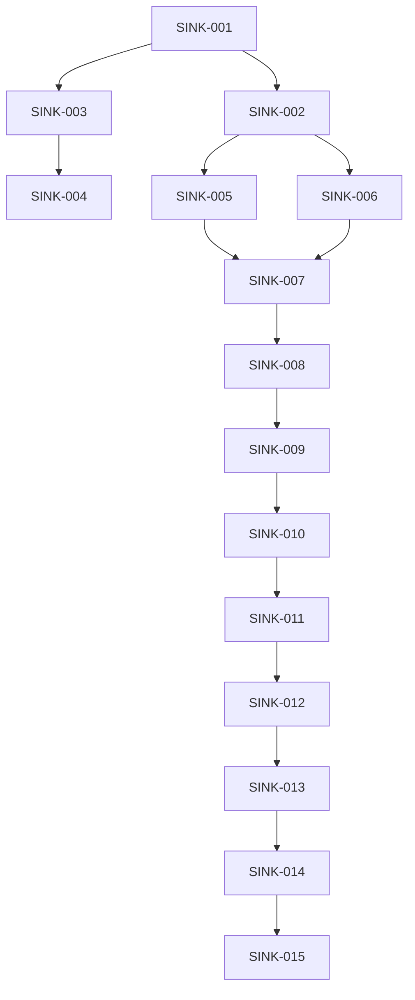

# Sprint 014: MessageSink Architecture & Lazy Connections

**Duration**: 5 days
**Start Date**: 2025-08-26
**End Date**: 2025-08-31
**Status**: NOT_STARTED

## Sprint Goals
1. Implement MessageSink trait architecture with lazy connection patterns for flexible, composable communication pathways that wake up as data flows
2. Create Stage 1 config-based registry that can seamlessly evolve to Stage 2 Mycelium API integration
3. Establish foundation for decoupled services with runtime discovery and zero startup order dependencies

## Context
The current architecture has tightly coupled service-to-service connections that are established eagerly at startup. This creates:
- Startup order dependencies
- Resource waste for unused connections
- Complex configuration management
- Difficulty in testing and mocking
- Inflexible message routing

This sprint introduces a MessageSink abstraction that allows services to define where messages go without knowing how they get there, combined with lazy connection patterns that establish connections only when data flows.

## Two-Stage Implementation Strategy

### Stage 1: Config-Based Registry (This Sprint)
```
┌──────────────────┐      ┌──────────────┐      ┌───────────────────┐      ┌──────────────────────┐
│   Adapter        │─────>│ SinkFactory  │─────>│ ServiceRegistry   │─────>│ network_primitives   │
│ (Business Logic) │      │              │      │ (reads services.toml)│     │ (makes connection)   │
└──────────────────┘      └──────────────┘      └───────────────────┘      └──────────────────────┘
```
- Build and test services with hybrid connection logic today
- Use simple TOML file for service discovery
- No waiting for Mycelium to be complete

### Stage 2: Mycelium API (Future Sprint)
```
┌──────────────────┐      ┌──────────────┐      ┌──────────────────────┐
│   Adapter        │─────>│ SinkFactory  │─────>│     Mycelium API     │
│ (Business Logic) │      │              │      │ (handles all config) │
└──────────────────┘      └──────────────┘      └──────────────────────┘
```
- Adapter code remains unchanged
- SinkFactory internally switches from TOML to Mycelium API
- Zero changes required in services like PolygonAdapter
- Mycelium handles all complex connection provisioning

**Key Insight**: Services remain completely unaware whether connections are managed by config file or sophisticated Mycelium API. This abstraction allows robust, decoupled system now while being perfectly positioned for advanced Mycelium integration later without disruptive refactoring.

## Task Summary
| Task ID | Description | Status | Priority | Hours |
|---------|-------------|--------|----------|-------|
| SINK-001 | Define MessageSink trait and core abstractions | TODO | CRITICAL | 3 |
| SINK-002 | Implement lazy connection wrapper | TODO | CRITICAL | 4 |
| SINK-003 | Build SinkFactory with configuration support | TODO | CRITICAL | 4 |
| SINK-004 | Create ServiceRegistry for runtime discovery | TODO | CRITICAL | 3 |
| SINK-005 | Implement relay-based MessageSinks | TODO | HIGH | 3 |
| SINK-006 | Implement direct connection sinks | TODO | HIGH | 3 |
| SINK-007 | Add composite sink patterns (fan-out, failover) | TODO | HIGH | 4 |
| SINK-008 | Build buffering and backpressure handling | TODO | HIGH | 3 |
| SINK-009 | Migrate first adapter to MessageSink | TODO | HIGH | 4 |
| SINK-010 | Update relay consumers to use lazy connections | TODO | MEDIUM | 3 |
| SINK-011 | Add monitoring and metrics | TODO | MEDIUM | 2 |
| SINK-012 | Create comprehensive tests | TODO | MEDIUM | 3 |
| SINK-013 | Write architecture documentation | TODO | LOW | 2 |
| SINK-014 | Create usage examples | TODO | LOW | 2 |
| SINK-015 | Performance benchmarks | TODO | LOW | 2 |

## Dependencies

### Internal Task Dependencies


### Sprint Dependencies
**Depends On**: 
- [ ] Sprint 013: Architecture Audit must complete codec integration
- [ ] Sprint 011: Control Script Pattern for service management

**Provides For**:
- Future Mycelium Integration: MessageSink abstraction is the foundation
- Sprint XXX: Enables advanced message routing patterns
- All future service development: Provides standard connection pattern

### Parallel Work Safe?
**✅ Can Run Concurrently With**:
- Sprint 012: Architecture Synthesis (documentation focus)
- Testing improvements: Different layers

**⚠️ Conflicts With**:
- Direct network code changes: Modifies connection layer
- Service startup changes: Changes initialization patterns

## Technical Approach

### Core MessageSink Trait
```rust
pub trait MessageSink: Send + Sync {
    async fn send(&self, message: Message) -> Result<(), SinkError>;
    async fn send_batch(&self, messages: Vec<Message>) -> Result<(), SinkError>;
    fn is_connected(&self) -> bool;
    async fn connect(&self) -> Result<(), SinkError>;
    async fn disconnect(&self) -> Result<(), SinkError>;
}
```

### Lazy Connection Pattern
```rust
pub struct LazyMessageSink<S: MessageSink> {
    inner: Arc<RwLock<Option<S>>>,
    factory: Arc<dyn Fn() -> Result<S, Error> + Send + Sync>,
}

impl<S: MessageSink> MessageSink for LazyMessageSink<S> {
    async fn send(&self, message: Message) -> Result<(), SinkError> {
        // Connect on first use
        if !self.is_connected() {
            self.connect().await?;
        }
        self.inner.read().await
            .as_ref()
            .unwrap()
            .send(message)
            .await
    }
}
```

### Stage 1: Config-Based Service Registry
```toml
# services.toml - Stage 1 configuration
[services.market_data_relay]
type = "relay"
endpoint = "unix:///tmp/market_data.sock"
buffer_size = 10000

[services.strategy_a]
type = "direct"  
endpoint = "tcp://127.0.0.1:9001"
reconnect_delay_ms = 1000

[services.broadcast_group]
type = "composite"
pattern = "fanout"
targets = ["market_data_relay", "strategy_a"]
```

### SinkFactory Pattern (Future-Proof)
```rust
pub struct SinkFactory {
    // Stage 1: Config-based
    registry: Arc<ServiceRegistry>,
    
    // Stage 2: Will be replaced with:
    // mycelium: Arc<MyceliumApi>,
}

impl SinkFactory {
    // This interface NEVER changes between Stage 1 and Stage 2
    pub async fn create_sink(&self, service: &str) -> Result<Box<dyn MessageSink>> {
        // Stage 1: Read from config
        let config = self.registry.lookup(service)?;
        
        // Stage 2: Will become:
        // let connection = self.mycelium.provision_connection(service).await?;
        
        Ok(create_sink_from_config(config))
    }
}
```

## Definition of Done
- [ ] MessageSink trait supports both relay and direct connections
- [ ] Connections established only when first message sent
- [ ] Zero startup order dependencies proven
- [ ] Service registry reads services.toml correctly
- [ ] At least one service fully migrated to MessageSink
- [ ] Performance overhead <1% vs direct connections
- [ ] All tests pass with lazy connections
- [ ] Documentation clearly shows Stage 1 → Stage 2 migration path
- [ ] No changes needed in adapters when switching to Mycelium

## Risk Mitigation
- **Risk 1**: Performance overhead from indirection → Mitigation: Use inline hints, benchmark critical paths
- **Risk 2**: Complex debugging with lazy connections → Mitigation: Add connection state logging
- **Risk 3**: Stage 2 migration complexity → Mitigation: Keep SinkFactory interface stable, only change internals

## Daily Progress
### Day 1 - 2025-08-26
- [ ] SINK-001: Define MessageSink trait
- [ ] SINK-002: Start lazy wrapper implementation
- [ ] Create worktree for development
- Notes: Foundation day - get core abstractions right

### Day 2 - 2025-08-27
- [ ] SINK-002: Complete lazy wrapper
- [ ] SINK-003: Build SinkFactory
- [ ] SINK-004: Create ServiceRegistry with TOML support
- Notes: Config-based Stage 1 implementation

### Day 3 - 2025-08-28
- [ ] SINK-005: Relay-based sinks
- [ ] SINK-006: Direct connection sinks
- [ ] SINK-007: Start composite patterns
- Notes: Concrete sink implementations

### Day 4 - 2025-08-29
- [ ] SINK-007: Complete composite patterns
- [ ] SINK-008: Buffering/backpressure
- [ ] SINK-009: Migrate first adapter
- Notes: Real-world usage and testing

### Day 5 - 2025-08-30
- [ ] SINK-010: Update relay consumers
- [ ] SINK-011: Monitoring/metrics
- [ ] SINK-012: Comprehensive tests
- [ ] SINK-013-015: Documentation and benchmarks
- Notes: Polish, test, document

## Success Metrics
- Zero code changes needed in adapters for Stage 2 migration
- Services can start in any order
- Connections only established when data flows
- Clear path from config-based to Mycelium-based
- All existing functionality preserved with new abstraction