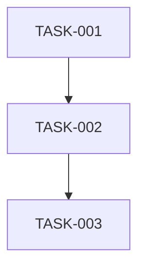

# Sprint 999: test-validation

**Duration**: 5 days
**Start Date**: 2025-08-26
**End Date**: 2025-08-31
**Status**: IN_PROGRESS

## Sprint Goals
1. Validate scrum tooling end-to-end functionality
2. Test task tracking and reporting systems
3. Verify auto-archiving and dependency checking

## Task Summary
| Task ID | Description | Status | Priority | Hours |
|---------|-------------|--------|----------|-------|
| TASK-001 | Test sprint creation and templates | TODO | CRITICAL | 1 |
| TASK-002 | Validate task status tracking | TODO | HIGH | 2 |
| TASK-003 | Test auto-archive functionality | TODO | HIGH | 2 |
| TASK-004 | Document gaps and improvements | TODO | MEDIUM | 1 |

## Dependencies

### Internal Task Dependencies


### Sprint Dependencies
**Depends On**: 
- [x] Sprint 002: Cleanup completed (example dependency)
- [x] Scrum tooling infrastructure in place

**Provides For**:
- Future sprints: Validated scrum process
- Sprint 1000: Tested framework ready for use

### Parallel Work Safe?
**✅ Can Run Concurrently With**:
- Sprint 007: Generic relay refactor (different domain)
- Sprint 009: Testing pyramid (no conflicts)

**⚠️ Conflicts With**:
- Sprint 1001: Hypothetical scrum tooling update (test conflict)

### Dependency Validation
```bash
# Before starting this sprint, verify:
# 1. All prerequisite sprints marked COMPLETE
# 2. No conflicting sprints are IN_PROGRESS
# 3. Required infrastructure/APIs available
```

## Definition of Done
- [ ] All tasks marked COMPLETE
- [ ] Tests passing (documented in TEST_RESULTS.md)
- [ ] PR merged to main
- [ ] No performance regressions
- [ ] Documentation updated

## Risk Mitigation
- **Risk 1**: Test data affects real sprints → Mitigation: Use high sprint number (999)
- **Risk 2**: Auto-archiving might archive wrong sprints → Mitigation: Test in isolated environment

## Daily Progress
### Day 1 - [Date]
- [ ] TASK-001 started
- [ ] Branch created
- Notes: 

### Day 2 - [Date]
- [ ] TASK-001 complete
- [ ] TASK-002 started
- Notes:

### Day 3 - [Date]
- [ ] TASK-002 complete
- [ ] TASK-003 started
- Notes:

### Day 4 - [Date]
- [ ] TASK-003 complete
- [ ] Integration testing
- Notes:

### Day 5 - [Date]
- [ ] Final testing
- [ ] PR review and merge
- Notes: