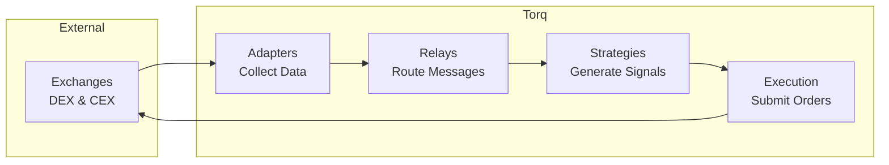

# Torq Backend V2

> **High-performance cryptocurrency trading system built on clean three-layer architecture**

## 🚀 Quick Start

```bash
# Prerequisites
rustc --version  # Requires 1.75+
python --version # Requires 3.10+
node --version   # Requires 18+

# Start system
./scripts/manage.sh up

# Check status
./scripts/manage.sh status

# View logs
./scripts/manage.sh logs

# Stop system
./scripts/manage.sh down
```

## 📊 Key Metrics

- **Throughput**: >1M messages/second
- **Latency**: <35μs hot path
- **Precision**: Zero loss (native token precision preserved)
- **Protocol**: Custom TLV with 32-byte headers

## 🏗️ Architecture Overview

The system follows a strict **three-layer architecture**:

1. **Data Layer** (`libs/types/`) - Pure TLV data structures and protocol definitions
2. **Rules Layer** (`libs/codec/`) - Message encoding/decoding and bijective IDs  
3. **Behavior Layer** (`services/`, `relays/`) - Active trading components

### Implemented Structure
```
backend_v2/
├── libs/                    # Shared Libraries
│   ├── codec/              # Protocol encoding/decoding (Rules Layer)
│   ├── types/              # TLV data structures (Data Layer)
│   ├── amm/                # AMM math utilities
│   ├── dex/                # DEX ABI and event handling
│   ├── mev/                # MEV protection utilities
│   ├── state/              # Market state management
│   └── message_sink/       # Message routing infrastructure
├── services/               # Service Implementations (Behavior Layer)
│   ├── adapters/           # Exchange data collectors
│   ├── strategies/         # Trading strategy engines
│   ├── dashboard/          # WebSocket dashboard server
│   └── observability/      # Trace collection and monitoring
├── relays/                 # Domain-specific message relays
│   ├── market_data_relay/  # Market data routing
│   ├── signal_relay/       # Trading signal routing
│   └── execution_relay/    # Order execution routing
├── tests/                  # Comprehensive test suites
│   ├── architecture_validation/  # Architecture compliance tests
│   └── e2e/               # End-to-end integration tests
└── scripts/               # System management and utilities
```



**For detailed architecture documentation, see [ARCHITECTURE.md](ARCHITECTURE.md)**

## 📋 System Management

The system provides a unified management interface through `manage.sh`:

### Core Operations
```bash
./scripts/manage.sh up        # Start all services
./scripts/manage.sh down      # Stop all services gracefully
./scripts/manage.sh restart   # Restart system
./scripts/manage.sh status    # Show service status
./scripts/manage.sh logs      # Stream service logs
```

### Development & Testing
```bash
./scripts/manage.sh validate  # Run architecture validation tests
./scripts/manage.sh test      # Run comprehensive test suite
```

### Demo & Development Tools
```bash
./scripts/manage.sh demo arbitrage    # Start demo arbitrage generator
./scripts/manage.sh demo mock-relay   # Start mock relay server
./scripts/manage.sh demo tlv-info     # Query TLV type information
```

### Deployment
```bash
./scripts/manage.sh deploy    # Deploy relay services
```

## 🛠️ Development

### Adding an Exchange Adapter
```bash
# Create adapter structure
mkdir -p services/adapters/new_exchange
cd services/adapters/new_exchange

# Implement adapter following pattern
cargo init --lib
# See services/adapters/polygon_dex for example
```

### Creating a TLV Type
```rust
// 1. Define TLV structure in libs/types/src/protocol/tlv/
use zerocopy::{AsBytes, FromBytes, Unaligned};

#[repr(C)]
#[derive(AsBytes, FromBytes, Unaligned, Debug, Clone)]
pub struct NewTLV {
    pub field1: u64,
    pub field2: i64,
}

// 2. Register in libs/codec/src/tlv_types.rs
pub enum TLVType {
    NewType = 15,  // Assign in correct domain range:
                   // Market Data (1-19), Signals (20-39), Execution (40-79)
}

// 3. Use codec for message construction
use codec::{TLVMessageBuilder, TLVType};

let mut builder = TLVMessageBuilder::new(domain, source);
builder.add_tlv(TLVType::NewType, &new_tlv_data);
let message = builder.build();
```

### Running Tests
```bash
# Unit tests
cargo test --workspace

# Integration tests
cargo test --package tests

# Performance benchmarks
cargo bench

# Architecture validation tests
cargo run --manifest-path tests/architecture_validation/Cargo.toml
```

### Python Development Utilities

The system includes consolidated Python utilities for development and testing:

```bash
# Precision violation detection (integrated with validate)
python3 scripts/lib/python/detect_precision_violations.py <path>

# Demo arbitrage data for dashboard testing
python3 scripts/lib/python/send_demo_arbitrage.py

# Mock relay server for development
python3 scripts/lib/python/mock_relay.py

# TLV type information query
python3 scripts/lib/python/query_tlv_info.py
```

All Python utilities are accessible through `manage.sh` commands.
```

## 📚 Documentation

| Document | Description |
|----------|------------|
| [ARCHITECTURE.md](ARCHITECTURE.md) | Complete system architecture |
| [docs/ARCHITECTURE_DETAILS.md](docs/ARCHITECTURE_DETAILS.md) | Technical deep dive |
| [docs/protocol.md](docs/protocol.md) | Protocol V2 specification |
| [CONTRIBUTING.md](CONTRIBUTING.md) | Development guidelines |
| [CLAUDE.md](CLAUDE.md) | AI assistant context |

## 🔒 Security

- **Network**: Unix sockets for local IPC, TLS for external
- **Data**: Checksums prevent corruption, native precision preserved
- **Operations**: Process isolation, graceful degradation

## 📈 Performance

Measured on commodity hardware (Intel i7, 16GB RAM):

| Operation | Rate | Latency |
|-----------|------|---------|
| Message Build | 1.09M/s | 0.9μs |
| Message Parse | 1.64M/s | 0.6μs |
| E2E Hot Path | 850K/s | 35μs |

## 🤝 Contributing

See [CONTRIBUTING.md](CONTRIBUTING.md) for guidelines.

## 📄 License

Proprietary - See [LICENSE](LICENSE) for details.

---

*Built with precision for professional cryptocurrency trading*